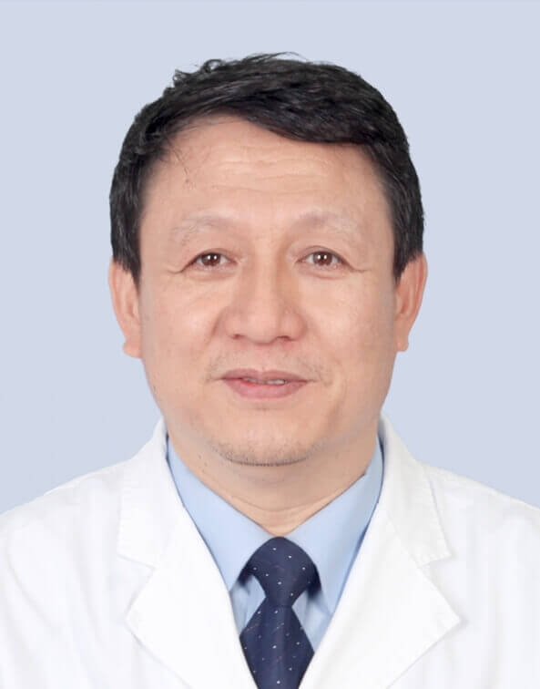

# 黄瑾

## 基础信息

| 字段 | 内容 |
|---|---|
| 姓名 | 黄瑾 |
| 医院 | 中山大学附属第五医院 |
| 科室 | 呼吸与危重症学科 |
| 职称/身份 | 内科主任，教授，主任医师，医学博士，博士生导师，首届珠海名医。 |
| 重点优先级 | 高 |
| 来源链接 | https://www.sysu5.cn/medical-service/department-expert/doctor/841 |
| 采集日期 | 2026-08-08 |

## 简介/擅长

黄瑾医生来自中山大学附属第五医院呼吸与危重症学科，官网公开资料中可提取到疑难重症方向线索。

## 可包装亮点

- 呼吸与危重症学科 呼吸与危重症学科 内科主任，教授，主任医师，医学博士，博士生导师，首届珠海名医。
- 内科主任，教授，主任医师，医学博士，博士生导师，首届珠海名医。

## 重点疾病/人群标签

- 慢性病：
- 肿瘤：
- 生殖疾病：
- 免疫/风湿：
- 术后恢复/康复：
- 疑难重症：疑难、危重、重症

## 证据摘录

> 以下只保留官网公开信息中的短句或关键字段，不复制大段原文。

- 官网身份字段：内科主任，教授，主任医师，医学博士，博士生导师，首届珠海名医。
- 官网经历线索：呼吸与危重症学科 呼吸与危重症学科 内科主任，教授，主任医师，医学博士，博士生导师，首届珠海名医。 内科主任，教授，主任医师，医学博士，博士生导师，首届珠海名医。
- 来源链接：https://www.sysu5.cn/medical-service/department-expert/doctor/841

## BD 画像摘要

黄瑾医生可作为疑难重症方向的医生画像候选。后续 BD 包装应围绕官网已展示的科室、职称、擅长和经历线索展开，保持待人工复核状态，不添加疗效承诺。

## 合规边界

- 本条画像仅基于医院官网公开医生详情页整理。
- 未采集私人联系方式、患者案例、非公开排班或第三方评价。
- 所有亮点均需保留来源链接，不得改写为治疗效果承诺。
