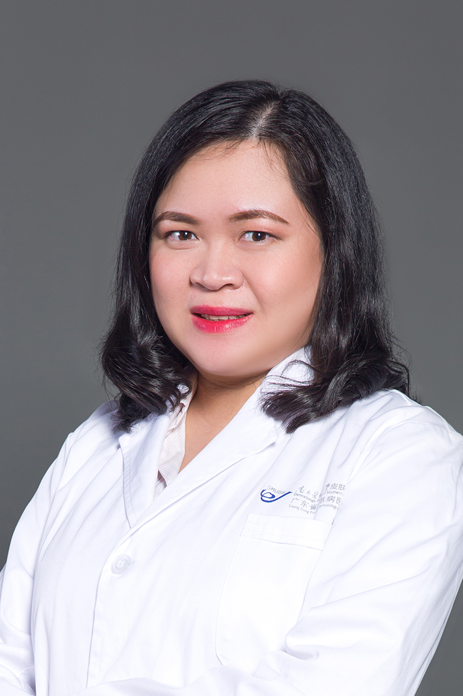

<!-- AUTO-GENERATED-BY: work/generate_obsidian_profiles.py -->

<!-- TEMPLATE: D:\workspace\信息收集整理\医生画像仓库\模板\医生画像模板.md -->

# 任盈盈

## 基础信息

| 字段 | 内容 |
|---|---|
| 姓名 | 任盈盈 |
| 医院 | 南方医科大学皮肤病医院 |
| 科室 | 中医皮肤科 |
| 职称/身份 | 主治医师、医学硕士 |
| 来源链接 | [官网原文](https://www.gdskin.com/ShowNews.ASPX?ID=5588) |
| 采集日期 | 2026-08-11 |

## 简介/擅长

白癜风，带状疱疹，银屑病

## 科研项目与成果

- 曾主持厅级课题1项，在国内期刊发表论文数篇。

## 论文与学术产出

- 曾主持厅级课题1项，在国内期刊发表论文数篇。

## 可包装亮点

- 曾主持厅级课题1项，在国内期刊发表论文数篇。
- 现任广东省针灸学会腧穴外治专委会常委，广东省中医药学会综合医院中医药工作委员会委员。

## 重点疾病/人群标签

- 慢性病：
- 肿瘤：
- 生殖疾病：
- 免疫/风湿：
- 术后恢复/康复：
- 疑难重症：

## 证据摘录

> 只摘录官网公开信息中的短句或关键字段，不复制大段原文。

- 官网身份字段：主治医师、医学硕士
- 官网简介/擅长：白癜风，带状疱疹，银屑病
- 官网亮眼经历线索：曾主持厅级课题1项，在国内期刊发表论文数篇。 现任广东省针灸学会腧穴外治专委会常委，广东省中医药学会综合医院中医药工作委员会委员。
- 来源链接：https://www.gdskin.com/ShowNews.ASPX?ID=5588

## BD 画像摘要

任盈盈医生可作为南方医科大学皮肤病医院中医皮肤科的基础医生资料入库。当前重点方向以总底表标签为准，官网未展示的信息保持空白。

## 合规边界

- 仅使用医院官网、官方公众号、官方小程序等公开渠道。
- 不采集私人电话、私人微信、家庭住址、患者隐私或非公开排班信息。
- 不写“保证治愈”“疗效第一”“包治疑难杂症”等无法由官网证明的表述。
