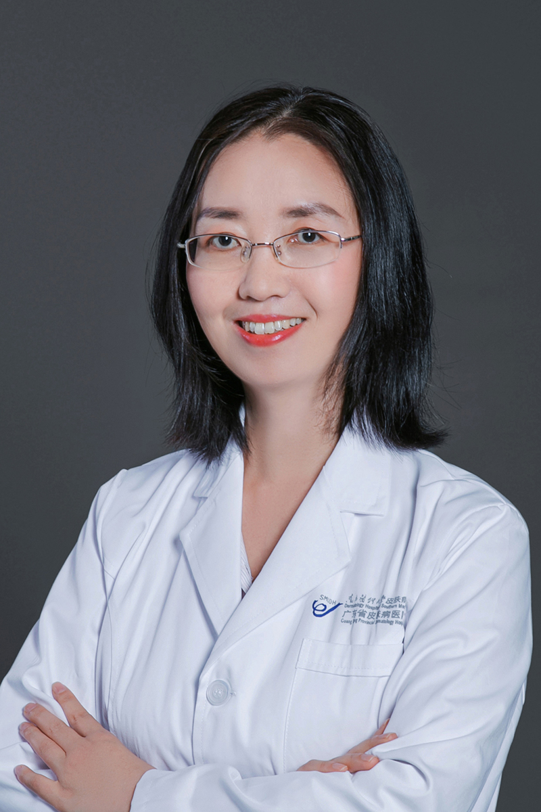

<!-- AUTO-GENERATED-BY: work/generate_obsidian_profiles.py -->

<!-- TEMPLATE: D:\workspace\信息收集整理\医生画像仓库\模板\医生画像模板.md -->

# 刘红芳

## 基础信息

| 字段 | 内容 |
|---|---|
| 姓名 | 刘红芳 |
| 医院 | 南方医科大学皮肤病医院 |
| 科室 | 皮肤内科 |
| 职称/身份 | 主任医师、硕士研究生导师、医学博士、美容皮肤科主诊医师 |
| 来源链接 | [官网原文](https://www.gdskin.com/ShowNews.ASPX?ID=3856) |
| 采集日期 | 2026-08-11 |

## 简介/擅长

感染性皮肤病、自身免疫性大疱性皮肤病

## 教育与进修经历

- 曾作为访问学者在美国国立卫生研究院进行学术交流。

## 科研项目与成果

- 从事皮肤性病学临床及科研工作10余年，擅长感染性皮肤病的诊疗及病原菌的鉴定，对大疱性皮肤病、重度痤疮、银屑病等重症皮肤病也有丰富的诊疗经验。
- 主持及参与国家自然科学基金3项，省级课题3项，发表中英文论文10余篇。

## 论文与学术产出

- 主持及参与国家自然科学基金3项，省级课题3项，发表中英文论文10余篇。

## 可包装亮点

- 南方医科大学皮肤病医院 皮肤内科 刘红芳 主任医师 刘红芳 主任医师 主任医师、硕士研究生导师、医学博士、美容皮肤科主诊医师 感染性皮肤病、自身免疫性大疱性皮肤病 从事皮肤性病学临床及科研工作10余年，擅长感染性皮肤病的诊疗及病原菌的鉴定，对大疱性皮肤病、重度痤疮、银屑病等重症皮肤病也有丰富的诊疗经验。
- 曾作为访问学者在美国国立卫生研究院进行学术交流。
- 主持及参与国家自然科学基金3项，省级课题3项，发表中英文论文10余篇。
- 现任中华医学会广东省皮肤科分会真菌学组副组长，中国医师协会皮肤科分会青年委员会委员、中华医学会皮肤科分会真菌学组委员等学术职务。

## 重点疾病/人群标签

- 慢性病：
- 肿瘤：
- 生殖疾病：
- 免疫/风湿：免疫、感染、重症
- 术后恢复/康复：
- 疑难重症：免疫、感染、重症

## 证据摘录

> 只摘录官网公开信息中的短句或关键字段，不复制大段原文。

- 官网身份字段：主任医师、硕士研究生导师、医学博士、美容皮肤科主诊医师
- 官网简介/擅长：感染性皮肤病、自身免疫性大疱性皮肤病
- 官网亮眼经历线索：南方医科大学皮肤病医院 皮肤内科 刘红芳 主任医师 刘红芳 主任医师 主任医师、硕士研究生导师、医学博士、美容皮肤科主诊医师 感染性皮肤病、自身免疫性大疱性皮肤病 从事皮肤性病学临床及科研工作10余年，擅长感染性皮肤病的诊疗及病原菌的鉴定，对大疱性皮肤病、重度痤疮、银屑病等重症皮肤病也有丰富的诊疗经验。 曾作为访问学者在美国国立卫生研究院进行学术交流。 主持及参与国家自然科学基金3项，省级课题3项，发表中英文论文10余篇。 现任中华医…
- 来源链接：https://www.gdskin.com/ShowNews.ASPX?ID=3856

## BD 画像摘要

刘红芳医生可作为免疫/风湿/感染、疑难重症方向的基础画像候选。后续 BD 使用应继续以官网来源和人工复核为准，不添加疗效承诺或无来源包装。

## 合规边界

- 仅使用医院官网、官方公众号、官方小程序等公开渠道。
- 不采集私人电话、私人微信、家庭住址、患者隐私或非公开排班信息。
- 不写“保证治愈”“疗效第一”“包治疑难杂症”等无法由官网证明的表述。
