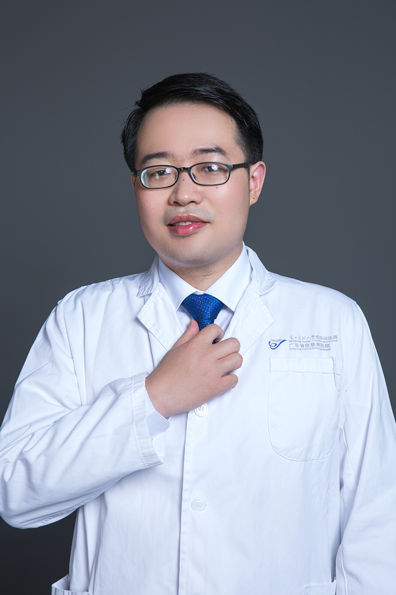

<!-- AUTO-GENERATED-BY: work/generate_obsidian_profiles.py -->

<!-- TEMPLATE: D:\workspace\信息收集整理\医生画像仓库\模板\医生画像模板.md -->

# 刘龙灿

## 基础信息

| 字段 | 内容 |
|---|---|
| 姓名 | 刘龙灿 |
| 医院 | 南方医科大学皮肤病医院 |
| 科室 | 整形美容外科 |
| 职称/身份 | 主治医师、医学硕士 |
| 来源链接 | [官网原文](https://www.gdskin.com/ShowNews.ASPX?ID=5582) |
| 采集日期 | 2026-08-11 |

## 简介/擅长

瘢痕综合治疗、腋臭微创手术、血管性疾病

## 教育与进修经历

- 毕业于清华大学医学部，曾在北京协和医院、中日友好医院进修。

## 科研项目与成果

- 参加省级科研课题1项，核心期刊发表文章数篇。

## 论文与学术产出

- 参加省级科研课题1项，核心期刊发表文章数篇。

## 可包装亮点

- 南方医科大学皮肤病医院 整形美容外科 刘龙灿 医师 刘龙灿 医师 主治医师、医学硕士 瘢痕综合治疗、腋臭微创手术、血管性疾病 毕业于清华大学医学部，曾在北京协和医院、中日友好医院进修。
- 参加省级科研课题1项，核心期刊发表文章数篇。

## 重点疾病/人群标签

- 慢性病：
- 肿瘤：
- 生殖疾病：
- 免疫/风湿：
- 术后恢复/康复：
- 疑难重症：

## 证据摘录

> 只摘录官网公开信息中的短句或关键字段，不复制大段原文。

- 官网身份字段：主治医师、医学硕士
- 官网简介/擅长：瘢痕综合治疗、腋臭微创手术、血管性疾病
- 官网亮眼经历线索：南方医科大学皮肤病医院 整形美容外科 刘龙灿 医师 刘龙灿 医师 主治医师、医学硕士 瘢痕综合治疗、腋臭微创手术、血管性疾病 毕业于清华大学医学部，曾在北京协和医院、中日友好医院进修。 参加省级科研课题1项，核心期刊发表文章数篇。
- 来源链接：https://www.gdskin.com/ShowNews.ASPX?ID=5582

## BD 画像摘要

刘龙灿医生可作为南方医科大学皮肤病医院整形美容外科的基础医生资料入库。当前重点方向以总底表标签为准，官网未展示的信息保持空白。

## 合规边界

- 仅使用医院官网、官方公众号、官方小程序等公开渠道。
- 不采集私人电话、私人微信、家庭住址、患者隐私或非公开排班信息。
- 不写“保证治愈”“疗效第一”“包治疑难杂症”等无法由官网证明的表述。
