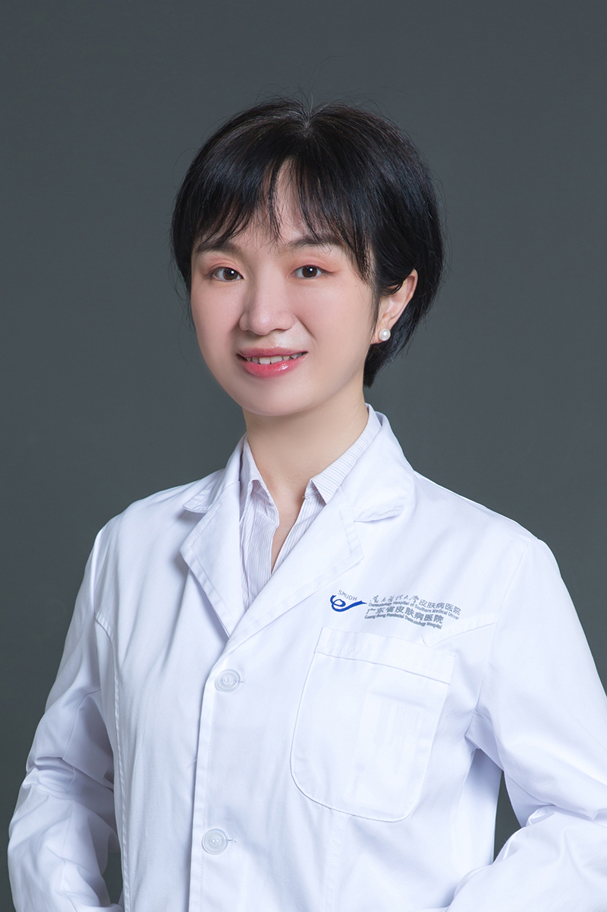

<!-- AUTO-GENERATED-BY: work/generate_obsidian_profiles.py -->

<!-- TEMPLATE: D:\workspace\信息收集整理\医生画像仓库\模板\医生画像模板.md -->

# 吉苏云

## 基础信息

| 字段 | 内容 |
|---|---|
| 姓名 | 吉苏云 |
| 医院 | 南方医科大学皮肤病医院 |
| 科室 | 皮肤内科 |
| 职称/身份 | 副主任医师、硕士研究生导师、医学博士、美容皮肤科主诊医师 |
| 来源链接 | [官网原文](https://www.gdskin.com/ShowNews.ASPX?ID=4846) |
| 采集日期 | 2026-08-11 |

## 简介/擅长

特应性皮炎、荨麻疹、银屑病

## 教育与进修经历

- 毕业于中山大学皮肤性病学专业，国家公派美国密西根大学访问学者。

## 科研项目与成果

- 主持国家及省级课题3项。

## 可包装亮点

- 南方医科大学皮肤病医院 皮肤内科 吉苏云 副主任医师 吉苏云 副主任医师 副主任医师、硕士研究生导师、医学博士、美容皮肤科主诊医师 特应性皮炎、荨麻疹、银屑病 毕业于中山大学皮肤性病学专业，国家公派美国密西根大学访问学者。
- 现任广东省医学会皮肤性病学分过敏与变态反应学组委员，广东省医学美容学会青年委员。

## 重点疾病/人群标签

- 慢性病：
- 肿瘤：
- 生殖疾病：
- 免疫/风湿：免疫
- 术后恢复/康复：
- 疑难重症：

## 证据摘录

> 只摘录官网公开信息中的短句或关键字段，不复制大段原文。

- 官网身份字段：副主任医师、硕士研究生导师、医学博士、美容皮肤科主诊医师
- 官网简介/擅长：特应性皮炎、荨麻疹、银屑病
- 官网亮眼经历线索：南方医科大学皮肤病医院 皮肤内科 吉苏云 副主任医师 吉苏云 副主任医师 副主任医师、硕士研究生导师、医学博士、美容皮肤科主诊医师 特应性皮炎、荨麻疹、银屑病 毕业于中山大学皮肤性病学专业，国家公派美国密西根大学访问学者。 现任广东省医学会皮肤性病学分过敏与变态反应学组委员，广东省医学美容学会青年委员。
- 来源链接：https://www.gdskin.com/ShowNews.ASPX?ID=4846

## BD 画像摘要

吉苏云医生可作为免疫/风湿/感染方向的基础画像候选。后续 BD 使用应继续以官网来源和人工复核为准，不添加疗效承诺或无来源包装。

## 合规边界

- 仅使用医院官网、官方公众号、官方小程序等公开渠道。
- 不采集私人电话、私人微信、家庭住址、患者隐私或非公开排班信息。
- 不写“保证治愈”“疗效第一”“包治疑难杂症”等无法由官网证明的表述。
