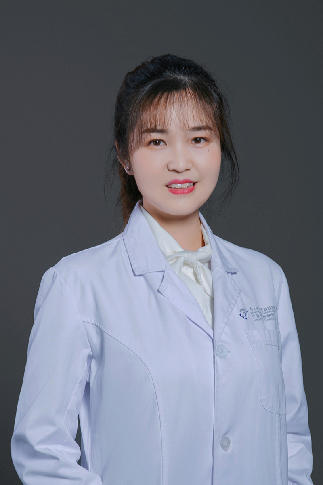

<!-- AUTO-GENERATED-BY: work/generate_obsidian_profiles.py -->

<!-- TEMPLATE: D:\workspace\信息收集整理\医生画像仓库\模板\医生画像模板.md -->

# 张娇

## 基础信息

| 字段 | 内容 |
|---|---|
| 姓名 | 张娇 |
| 医院 | 南方医科大学皮肤病医院 |
| 科室 | 皮肤内科 |
| 职称/身份 | 主治医师、医学硕士 |
| 来源链接 | [官网原文](https://www.gdskin.com/ShowNews.ASPX?ID=5574) |
| 采集日期 | 2026-08-11 |

## 简介/擅长

自身免疫性大疱病、过敏性皮肤病、银屑病

## 教育与进修经历

- 毕业于安徽医科大学，致力于皮肤性病诊疗工作多年，熟练掌握皮肤科常见病、多发病的诊疗，对银屑病、荨麻疹、带状疱疹等皮肤科常见疾病具有较强的诊疗能力，参与多例重症天疱疮、重症药疹、系统性红斑狼疮等重症皮肤病的救治并具有丰富的经验。

## 科研项目与成果

- 参与多项省部级课题的研究，先后在国内外核心期刊发表论文10篇。

## 论文与学术产出

- 参与多项省部级课题的研究，先后在国内外核心期刊发表论文10篇。

## 可包装亮点

- 参与多项省部级课题的研究，先后在国内外核心期刊发表论文10篇。

## 重点疾病/人群标签

- 慢性病：
- 肿瘤：
- 生殖疾病：
- 免疫/风湿：免疫、红斑狼疮、重症
- 术后恢复/康复：
- 疑难重症：免疫、红斑狼疮、重症

## 证据摘录

> 只摘录官网公开信息中的短句或关键字段，不复制大段原文。

- 官网身份字段：主治医师、医学硕士
- 官网简介/擅长：自身免疫性大疱病、过敏性皮肤病、银屑病
- 官网亮眼经历线索：参与多项省部级课题的研究，先后在国内外核心期刊发表论文10篇。
- 来源链接：https://www.gdskin.com/ShowNews.ASPX?ID=5574

## BD 画像摘要

张娇医生可作为免疫/风湿/感染、疑难重症方向的基础画像候选。后续 BD 使用应继续以官网来源和人工复核为准，不添加疗效承诺或无来源包装。

## 合规边界

- 仅使用医院官网、官方公众号、官方小程序等公开渠道。
- 不采集私人电话、私人微信、家庭住址、患者隐私或非公开排班信息。
- 不写“保证治愈”“疗效第一”“包治疑难杂症”等无法由官网证明的表述。
