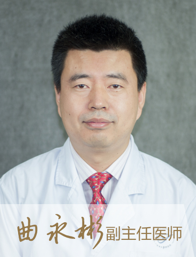

<!-- AUTO-GENERATED-BY: work/generate_obsidian_profiles.py -->

<!-- TEMPLATE: D:\workspace\信息收集整理\医生画像仓库\模板\医生画像模板.md -->

# 曲永彬

## 基础信息

| 字段 | 内容 |
|---|---|
| 姓名 | 曲永彬 |
| 医院 | 南方医科大学皮肤病医院 |
| 科室 | 中医皮肤科 |
| 职称/身份 | 主任医师、医学硕士 、美容中医科主诊医师 |
| 来源链接 | [官网原文](https://www.gdskin.com/ShowNews.ASPX?ID=4324) |
| 采集日期 | 2026-08-11 |

## 简介/擅长

银屑病、痤疮、黄褐斑

## 教育与进修经历

- 毕业于广州中医药大学，从事中医皮肤病科临床、教学、科研工作20年，对中医、中西医结合治疗银屑病、白癜风、痤疮、黄褐斑、光线性皮肤病及面部激素依赖性皮炎等顽固性皮肤病有丰富的经验，对针灸治疗皮肤病亦有研究。

## 科研项目与成果

- 毕业于广州中医药大学，从事中医皮肤病科临床、教学、科研工作20年，对中医、中西医结合治疗银屑病、白癜风、痤疮、黄褐斑、光线性皮肤病及面部激素依赖性皮炎等顽固性皮肤病有丰富的经验，对针灸治疗皮肤病亦有研究。
- 主持省市级课题3项，发表学术论文10余篇。

## 论文与学术产出

- 主持省市级课题3项，发表学术论文10余篇。

## 可包装亮点

- 南方医科大学皮肤病医院 中医皮肤科 曲永彬 主任医师 曲永彬 主任医师 主任医师、医学硕士 、美容中医科主诊医师 银屑病、痤疮、黄褐斑 毕业于广州中医药大学，从事中医皮肤病科临床、教学、科研工作20年，对中医、中西医结合治疗银屑病、白癜风、痤疮、黄褐斑、光线性皮肤病及面部激素依赖性皮炎等顽固性皮肤病有丰富的经验，对针灸治疗皮肤病亦有研究。
- 主持省市级课题3项，发表学术论文10余篇。
- 任广东省针灸学会皮肤病专业委员会副主任委员 ，广东省中医药学会皮肤病专业委员会委员，广东省医学会皮肤性病学分会治疗学组成员。

## 重点疾病/人群标签

- 慢性病：
- 肿瘤：
- 生殖疾病：
- 免疫/风湿：
- 术后恢复/康复：
- 疑难重症：

## 证据摘录

> 只摘录官网公开信息中的短句或关键字段，不复制大段原文。

- 官网身份字段：主任医师、医学硕士 、美容中医科主诊医师
- 官网简介/擅长：银屑病、痤疮、黄褐斑
- 官网亮眼经历线索：南方医科大学皮肤病医院 中医皮肤科 曲永彬 主任医师 曲永彬 主任医师 主任医师、医学硕士 、美容中医科主诊医师 银屑病、痤疮、黄褐斑 毕业于广州中医药大学，从事中医皮肤病科临床、教学、科研工作20年，对中医、中西医结合治疗银屑病、白癜风、痤疮、黄褐斑、光线性皮肤病及面部激素依赖性皮炎等顽固性皮肤病有丰富的经验，对针灸治疗皮肤病亦有研究。 主持省市级课题3项，发表学术论文10余篇。 任广东省针灸学会皮肤病专业委员会副主任委员 ，广东省…
- 来源链接：https://www.gdskin.com/ShowNews.ASPX?ID=4324

## BD 画像摘要

曲永彬医生可作为南方医科大学皮肤病医院中医皮肤科的基础医生资料入库。当前重点方向以总底表标签为准，官网未展示的信息保持空白。

## 合规边界

- 仅使用医院官网、官方公众号、官方小程序等公开渠道。
- 不采集私人电话、私人微信、家庭住址、患者隐私或非公开排班信息。
- 不写“保证治愈”“疗效第一”“包治疑难杂症”等无法由官网证明的表述。
