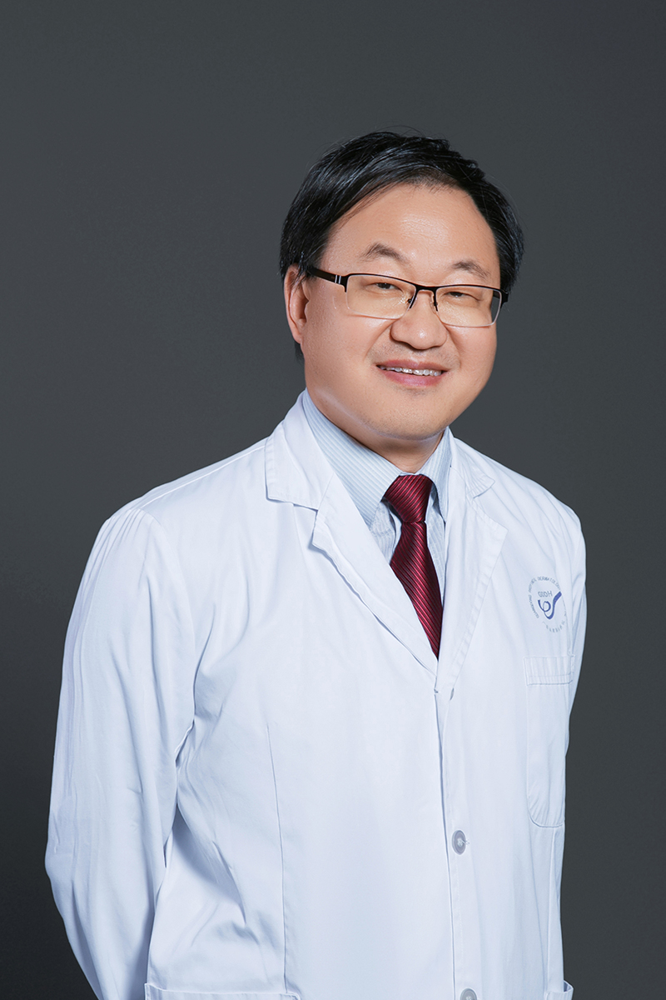

<!-- AUTO-GENERATED-BY: work/generate_obsidian_profiles.py -->

<!-- TEMPLATE: D:\workspace\信息收集整理\医生画像仓库\模板\医生画像模板.md -->

# 李慧忠

## 基础信息

| 字段 | 内容 |
|---|---|
| 姓名 | 李慧忠 |
| 医院 | 南方医科大学皮肤病医院 |
| 科室 | 皮肤内科 |
| 职称/身份 | 主任医师、医学硕士、美容皮肤科主诊医师 |
| 来源链接 | [官网原文](https://www.gdskin.com/ShowNews.ASPX?ID=3853) |
| 采集日期 | 2026-08-11 |

## 简介/擅长

面部色斑及敏感性疾病、痤疮

## 可包装亮点

- 南方医科大学皮肤病医院 皮肤内科 李慧忠 主任医师 李慧忠 主任医师 主任医师、医学硕士、美容皮肤科主诊医师 面部色斑及敏感性疾病、痤疮 从事皮肤科临床工作20余年，在皮肤激光美容、面部年轻化、过敏性皮肤病及痤疮、色斑、面部红斑等损容性皮肤病的诊治方面有丰富的临床经验，曾荣获“岭南名医”及“羊城好医生”等称号。
- 现任中华医学会激光医学分会皮肤整形美容学组委员、广东省医学会激光医学分会副主任委员、广东省医学会皮肤性病学分会美容与光电治疗学组副组长、广东省整形美容协会皮肤美容分会副主任委员等学术职务。

## 重点疾病/人群标签

- 慢性病：
- 肿瘤：
- 生殖疾病：
- 免疫/风湿：
- 术后恢复/康复：
- 疑难重症：

## 证据摘录

> 只摘录官网公开信息中的短句或关键字段，不复制大段原文。

- 官网身份字段：主任医师、医学硕士、美容皮肤科主诊医师
- 官网简介/擅长：面部色斑及敏感性疾病、痤疮
- 官网亮眼经历线索：南方医科大学皮肤病医院 皮肤内科 李慧忠 主任医师 李慧忠 主任医师 主任医师、医学硕士、美容皮肤科主诊医师 面部色斑及敏感性疾病、痤疮 从事皮肤科临床工作20余年，在皮肤激光美容、面部年轻化、过敏性皮肤病及痤疮、色斑、面部红斑等损容性皮肤病的诊治方面有丰富的临床经验，曾荣获“岭南名医”及“羊城好医生”等称号。 现任中华医学会激光医学分会皮肤整形美容学组委员、广东省医学会激光医学分会副主任委员、广东省医学会皮肤性病学分会美容与光电治疗…
- 来源链接：https://www.gdskin.com/ShowNews.ASPX?ID=3853

## BD 画像摘要

李慧忠医生可作为南方医科大学皮肤病医院皮肤内科的基础医生资料入库。当前重点方向以总底表标签为准，官网未展示的信息保持空白。

## 合规边界

- 仅使用医院官网、官方公众号、官方小程序等公开渠道。
- 不采集私人电话、私人微信、家庭住址、患者隐私或非公开排班信息。
- 不写“保证治愈”“疗效第一”“包治疑难杂症”等无法由官网证明的表述。
