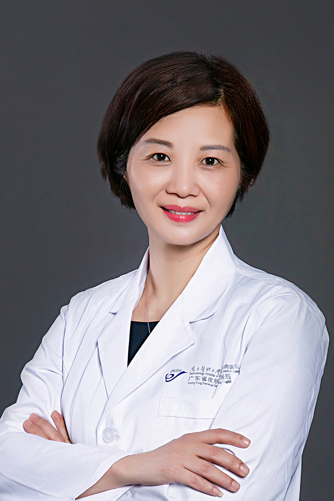

<!-- AUTO-GENERATED-BY: work/generate_obsidian_profiles.py -->

<!-- TEMPLATE: D:\workspace\信息收集整理\医生画像仓库\模板\医生画像模板.md -->

# 杨斌

## 基础信息

| 字段 | 内容 |
|---|---|
| 姓名 | 杨斌 |
| 医院 | 南方医科大学皮肤病医院 |
| 科室 |  |
| 职称/身份 | 主任医师、博士生导师、国务院特殊津贴专家、现任南方医科大学皮肤病医院院长、美容皮肤科主诊医师 |
| 来源链接 | [官网原文](https://www.gdskin.com/ShowNews.ASPX?ID=3847) |
| 采集日期 | 2026-08-11 |

## 简介/擅长

免疫性皮肤病、损容性皮肤病

## 教育与进修经历

- 中南大学湘雅医学院博士毕业，从事皮肤性病专业医教研多年，医学理论扎实，擅长免疫性皮肤病、损容性皮肤病诊治，并在医疗美容方面积累丰富临床经验。

## 科研项目与成果

- 近5年来主持完成国家、省部级及国际合作项目13项。

## 论文与学术产出

- 以第一作者或通讯作者发表学术论文120余篇，SCI收录80余篇，先后获得广东省科学技术进步奖二、三等奖。

## 可包装亮点

- 南方医科大学皮肤病医院 杨斌 院长/主任医师/博士研究生导师/国务院特殊津贴专家 杨斌 院长/主任医师/博士研究生导师/国务院特殊津贴专家 主任医师、博士生导师、国务院特殊津贴专家、现任南方医科大学皮肤病医院院长、美容皮肤科主诊医师 免疫性皮肤病、损容性皮肤病 中南大学湘雅医学院博士毕业，从事皮肤性病专业医教研多年，医学理论扎实，擅长免疫性皮肤病、损容性皮…
- 以第一作者或通讯作者发表学术论文120余篇，SCI收录80余篇，先后获得广东省科学技术进步奖二、三等奖。
- 曾荣获“全国先进工作者”、“全国优秀中青年医师”、“第二届广东医师奖”、“广东省优秀院长”等称号。
- 现任中国医师协会皮肤科医师分会副会长、中华医学会皮肤性病分会委员、中国整形美容协会皮肤美容分会副主委、广东省医学会皮肤性病学分会主任委员、广东省预防医学会理事会副会长、广东省医师协会皮肤科医师分会副主委、广东省整形美容协会副...

## 重点疾病/人群标签

- 慢性病：
- 肿瘤：
- 生殖疾病：
- 免疫/风湿：免疫
- 术后恢复/康复：
- 疑难重症：

## 证据摘录

> 只摘录官网公开信息中的短句或关键字段，不复制大段原文。

- 官网身份字段：主任医师、博士生导师、国务院特殊津贴专家、现任南方医科大学皮肤病医院院长、美容皮肤科主诊医师
- 官网简介/擅长：免疫性皮肤病、损容性皮肤病
- 官网亮眼经历线索：南方医科大学皮肤病医院 杨斌 院长/主任医师/博士研究生导师/国务院特殊津贴专家 杨斌 院长/主任医师/博士研究生导师/国务院特殊津贴专家 主任医师、博士生导师、国务院特殊津贴专家、现任南方医科大学皮肤病医院院长、美容皮肤科主诊医师 免疫性皮肤病、损容性皮肤病 中南大学湘雅医学院博士毕业，从事皮肤性病专业医教研多年，医学理论扎实，擅长免疫性皮肤病、损容性皮肤病诊治，并在医疗美容方面积累丰富临床经验。 以第一作者或通讯作者发表学术论文1…
- 来源链接：https://www.gdskin.com/ShowNews.ASPX?ID=3847

## BD 画像摘要

杨斌医生可作为免疫/风湿/感染方向的基础画像候选。后续 BD 使用应继续以官网来源和人工复核为准，不添加疗效承诺或无来源包装。

## 合规边界

- 仅使用医院官网、官方公众号、官方小程序等公开渠道。
- 不采集私人电话、私人微信、家庭住址、患者隐私或非公开排班信息。
- 不写“保证治愈”“疗效第一”“包治疑难杂症”等无法由官网证明的表述。
