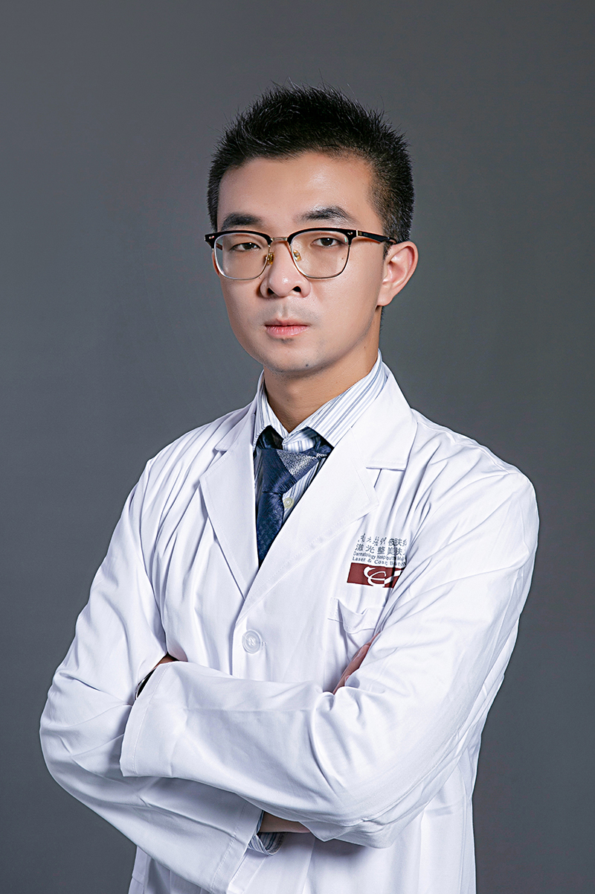

<!-- AUTO-GENERATED-BY: work/generate_obsidian_profiles.py -->

<!-- TEMPLATE: D:\workspace\信息收集整理\医生画像仓库\模板\医生画像模板.md -->

# 谢恒

## 基础信息

| 字段 | 内容 |
|---|---|
| 姓名 | 谢恒 |
| 医院 | 南方医科大学皮肤病医院 |
| 科室 | 激光美肤中心 |
| 职称/身份 | 医师 医学博士 |
| 来源链接 | [官网原文](https://www.gdskin.com/ShowNews.ASPX?ID=5605) |
| 采集日期 | 2026-08-11 |

## 简介/擅长

常见损容性皮肤病如痤疮、酒糟鼻、敏感性皮肤、激素依赖性皮炎、各类色斑等疾病的治疗，以及激光、射频、水光针、注射等美容技术的操作

## 教育与进修经历

- 毕业于四川大学华西医院，师从我国著名皮肤美容专家李利，主要研究方向为各类面部炎症性疾病治疗、医学护肤品功效评价、真皮干细胞及其外泌体的抗衰老功效。

## 论文与学术产出

- 发表SCI论文及北大核心论文多篇。

## 可包装亮点

- 发表SCI论文及北大核心论文多篇。

## 重点疾病/人群标签

- 慢性病：
- 肿瘤：
- 生殖疾病：
- 免疫/风湿：
- 术后恢复/康复：
- 疑难重症：

## 证据摘录

> 只摘录官网公开信息中的短句或关键字段，不复制大段原文。

- 官网身份字段：医师 医学博士
- 官网简介/擅长：常见损容性皮肤病如痤疮、酒糟鼻、敏感性皮肤、激素依赖性皮炎、各类色斑等疾病的治疗，以及激光、射频、水光针、注射等美容技术的操作
- 官网亮眼经历线索：发表SCI论文及北大核心论文多篇。
- 来源链接：https://www.gdskin.com/ShowNews.ASPX?ID=5605

## BD 画像摘要

谢恒医生可作为南方医科大学皮肤病医院激光美肤中心的基础医生资料入库。当前重点方向以总底表标签为准，官网未展示的信息保持空白。

## 合规边界

- 仅使用医院官网、官方公众号、官方小程序等公开渠道。
- 不采集私人电话、私人微信、家庭住址、患者隐私或非公开排班信息。
- 不写“保证治愈”“疗效第一”“包治疑难杂症”等无法由官网证明的表述。
