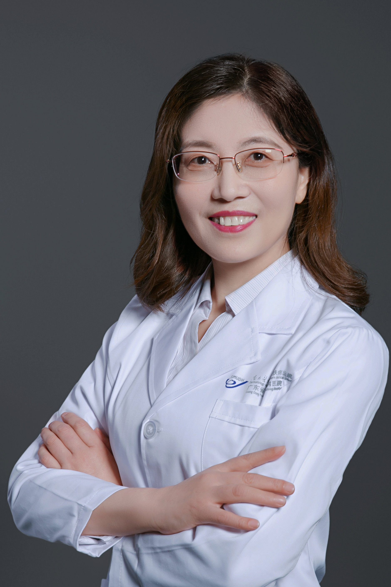

<!-- AUTO-GENERATED-BY: work/generate_obsidian_profiles.py -->

<!-- TEMPLATE: D:\workspace\信息收集整理\医生画像仓库\模板\医生画像模板.md -->

# 谷梅

## 基础信息

| 字段 | 内容 |
|---|---|
| 姓名 | 谷梅 |
| 医院 | 南方医科大学皮肤病医院 |
| 科室 | 皮肤内科 |
| 职称/身份 | 主任医师、医学硕士、美容皮肤科主诊医师 |
| 来源链接 | [官网原文](https://www.gdskin.com/ShowNews.ASPX?ID=3849) |
| 采集日期 | 2026-08-11 |

## 简介/擅长

过敏性皮肤病、痤疮及疤痕

## 教育与进修经历

- 从事皮肤性病临床、教学、科研工作30多年，曾在复旦大学华山医院、北京大学第一医院进修学习，擅长特应性皮炎、湿疹、荨麻疹、面部皮炎等过敏性皮肤病、痤疮及疤痕、脱发、白癜风等疾病的诊治。

## 科研项目与成果

- 从事皮肤性病临床、教学、科研工作30多年，曾在复旦大学华山医院、北京大学第一医院进修学习，擅长特应性皮炎、湿疹、荨麻疹、面部皮炎等过敏性皮肤病、痤疮及疤痕、脱发、白癜风等疾病的诊治。

## 可包装亮点

- 南方医科大学皮肤病医院 皮肤内科 谷梅 主任医师 谷梅 主任医师 主任医师、医学硕士、美容皮肤科主诊医师 过敏性皮肤病、痤疮及疤痕 从事皮肤性病临床、教学、科研工作30多年，曾在复旦大学华山医院、北京大学第一医院进修学习，擅长特应性皮炎、湿疹、荨麻疹、面部皮炎等过敏性皮肤病、痤疮及疤痕、脱发、白癜风等疾病的诊治。
- 曾获广东省“岭南名医”、“羊城好医生”等称号。

## 重点疾病/人群标签

- 慢性病：
- 肿瘤：
- 生殖疾病：
- 免疫/风湿：
- 术后恢复/康复：
- 疑难重症：

## 证据摘录

> 只摘录官网公开信息中的短句或关键字段，不复制大段原文。

- 官网身份字段：主任医师、医学硕士、美容皮肤科主诊医师
- 官网简介/擅长：过敏性皮肤病、痤疮及疤痕
- 官网亮眼经历线索：南方医科大学皮肤病医院 皮肤内科 谷梅 主任医师 谷梅 主任医师 主任医师、医学硕士、美容皮肤科主诊医师 过敏性皮肤病、痤疮及疤痕 从事皮肤性病临床、教学、科研工作30多年，曾在复旦大学华山医院、北京大学第一医院进修学习，擅长特应性皮炎、湿疹、荨麻疹、面部皮炎等过敏性皮肤病、痤疮及疤痕、脱发、白癜风等疾病的诊治。 曾获广东省“岭南名医”、“羊城好医生”等称号。
- 来源链接：https://www.gdskin.com/ShowNews.ASPX?ID=3849

## BD 画像摘要

谷梅医生可作为南方医科大学皮肤病医院皮肤内科的基础医生资料入库。当前重点方向以总底表标签为准，官网未展示的信息保持空白。

## 合规边界

- 仅使用医院官网、官方公众号、官方小程序等公开渠道。
- 不采集私人电话、私人微信、家庭住址、患者隐私或非公开排班信息。
- 不写“保证治愈”“疗效第一”“包治疑难杂症”等无法由官网证明的表述。
