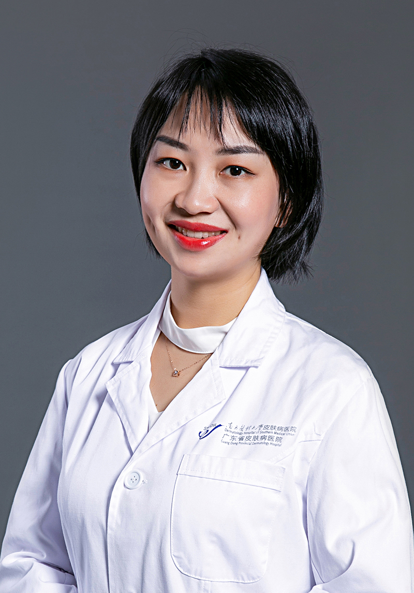

<!-- AUTO-GENERATED-BY: work/generate_obsidian_profiles.py -->

<!-- TEMPLATE: D:\workspace\信息收集整理\医生画像仓库\模板\医生画像模板.md -->

# 陈阳霞

## 基础信息

| 字段 | 内容 |
|---|---|
| 姓名 | 陈阳霞 |
| 医院 | 南方医科大学皮肤病医院 |
| 科室 | 皮肤内科 |
| 职称/身份 | 主治医师、医学博士、美容皮肤科主诊医师 |
| 来源链接 | [官网原文](https://www.gdskin.com/ShowNews.ASPX?ID=5571) |
| 采集日期 | 2026-08-11 |

## 简介/擅长

感染性皮肤病、脱发、过敏性皮肤病

## 教育与进修经历

- 毕业于中山大学，曾于北京大学第一医院进修学习，擅长皮肤科感染性、毛发相关性皮肤病、过敏性皮肤病等皮肤病诊疗。

## 科研项目与成果

- 主持参与国家与省级医学科研课题多项，发表医学研究论文多篇。

## 论文与学术产出

- 主持参与国家与省级医学科研课题多项，发表医学研究论文多篇。

## 可包装亮点

- 南方医科大学皮肤病医院 皮肤内科 陈阳霞 主治医师 陈阳霞 主治医师 主治医师、医学博士、美容皮肤科主诊医师 感染性皮肤病、脱发、过敏性皮肤病 毕业于中山大学，曾于北京大学第一医院进修学习，擅长皮肤科感染性、毛发相关性皮肤病、过敏性皮肤病等皮肤病诊疗。
- 主持参与国家与省级医学科研课题多项，发表医学研究论文多篇。

## 重点疾病/人群标签

- 慢性病：
- 肿瘤：
- 生殖疾病：
- 免疫/风湿：感染
- 术后恢复/康复：
- 疑难重症：

## 证据摘录

> 只摘录官网公开信息中的短句或关键字段，不复制大段原文。

- 官网身份字段：主治医师、医学博士、美容皮肤科主诊医师
- 官网简介/擅长：感染性皮肤病、脱发、过敏性皮肤病
- 官网亮眼经历线索：南方医科大学皮肤病医院 皮肤内科 陈阳霞 主治医师 陈阳霞 主治医师 主治医师、医学博士、美容皮肤科主诊医师 感染性皮肤病、脱发、过敏性皮肤病 毕业于中山大学，曾于北京大学第一医院进修学习，擅长皮肤科感染性、毛发相关性皮肤病、过敏性皮肤病等皮肤病诊疗。 主持参与国家与省级医学科研课题多项，发表医学研究论文多篇。
- 来源链接：https://www.gdskin.com/ShowNews.ASPX?ID=5571

## BD 画像摘要

陈阳霞医生可作为免疫/风湿/感染方向的基础画像候选。后续 BD 使用应继续以官网来源和人工复核为准，不添加疗效承诺或无来源包装。

## 合规边界

- 仅使用医院官网、官方公众号、官方小程序等公开渠道。
- 不采集私人电话、私人微信、家庭住址、患者隐私或非公开排班信息。
- 不写“保证治愈”“疗效第一”“包治疑难杂症”等无法由官网证明的表述。
