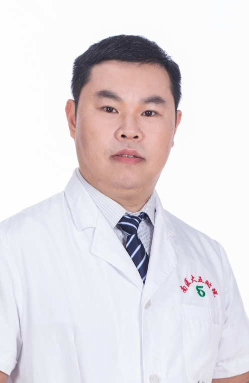

<!-- AUTO-GENERATED-BY: work/generate_obsidian_profiles.py -->

<!-- TEMPLATE: D:\workspace\信息收集整理\医生画像仓库\模板\医生画像模板.md -->

# 丁超

## 基础信息

| 字段 | 内容 |
|---|---|
| 姓名 | 丁超 |
| 医院 | 南方医科大学第五附属医院 |
| 科室 | 创伤骨科 |
| 职称/身份 | 副主任医师 |
| 来源链接 | [官网原文](http://www.ny5y.cn/yisheng_xq.php?id=447) |
| 采集日期 | 2026-08-12 |

## 简介/擅长

擅长严重多发伤的救治；四肢严重骨与关节损伤、骨盆及髋臼骨折的微创治疗；手外伤，断肢再植，骨折不愈合、骨坏死等

## 教育与进修经历

- 毕业于南方医科大学，硕士研究生，副主任医师，毕业后一直从事创伤骨科临床、科研、教学工作；
- 先后在南方医科大学珠江医院骨科，南方医科大学解剖教研室，重庆大学附属中心医院创伤中心进修学习。

## 科研项目与成果

- 毕业于南方医科大学，硕士研究生，副主任医师，毕业后一直从事创伤骨科临床、科研、教学工作；
- 近年来主持省市级课题两项，参与国自然课题一项，发表论文多篇。

## 论文与学术产出

- 近年来主持省市级课题两项，参与国自然课题一项，发表论文多篇。

## 可包装亮点

- 毕业于南方医科大学，硕士研究生，副主任医师，毕业后一直从事创伤骨科临床、科研、教学工作；
- 先后在南方医科大学珠江医院骨科，南方医科大学解剖教研室，重庆大学附属中心医院创伤中心进修学习。
- 担任 中国骨科医师协会骨科分会外固定工作委员会委员，广东省医疗行业协会骨关节外科管理分会委员 .广东省老年保健协会创骨专委会委员兼秘书，广州市医学会显微外科学分会第一届委员会委员。
- 近年来主持省市级课题两项，参与国自然课题一项，发表论文多篇。

## 重点疾病/人群标签

- 慢性病：
- 肿瘤：肿瘤、感染
- 生殖疾病：
- 免疫/风湿：肿瘤、感染
- 术后恢复/康复：
- 疑难重症：

## 证据摘录

> 只摘录官网公开信息中的短句或关键字段，不复制大段原文。

- 官网身份字段：副主任医师
- 官网简介/擅长：擅长严重多发伤的救治；四肢严重骨与关节损伤、骨盆及髋臼骨折的微创治疗；手外伤，断肢再植，骨折不愈合、骨坏死等
- 官网亮眼经历线索：毕业于南方医科大学，硕士研究生，副主任医师，毕业后一直从事创伤骨科临床、科研、教学工作； 先后在南方医科大学珠江医院骨科，南方医科大学解剖教研室，重庆大学附属中心医院创伤中心进修学习。 担任 中国骨科医师协会骨科分会外固定工作委员会委员，广东省医疗行业协会骨关节外科管理分会委员 .广东省老年保健协会创骨专委会委员兼秘书，广州市医学会显微外科学分会第一届委员会委员。 近年来主持省市级课题两项，参与国自然课题一项，发表论文多篇。
- 来源链接：http://www.ny5y.cn/yisheng_xq.php?id=447

## BD 画像摘要

丁超医生可作为肿瘤、免疫/风湿/感染方向的基础画像候选。后续 BD 使用应继续以官网来源和人工复核为准，不添加疗效承诺或无来源包装。

## 合规边界

- 仅使用医院官网、官方公众号、官方小程序等公开渠道。
- 不采集私人电话、私人微信、家庭住址、患者隐私或非公开排班信息。
- 不写“保证治愈”“疗效第一”“包治疑难杂症”等无法由官网证明的表述。
