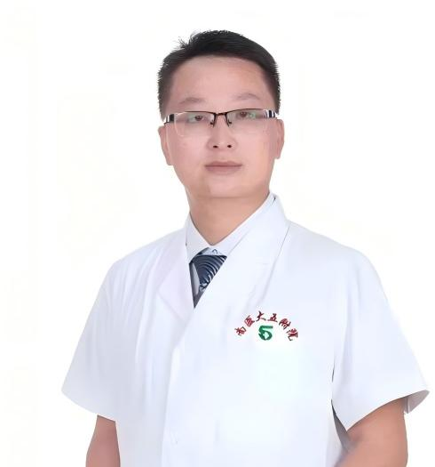

<!-- AUTO-GENERATED-BY: work/generate_obsidian_profiles.py -->

<!-- TEMPLATE: D:\workspace\信息收集整理\医生画像仓库\模板\医生画像模板.md -->

# 刘玉峰

## 基础信息

| 字段 | 内容 |
|---|---|
| 姓名 | 刘玉峰 |
| 医院 | 南方医科大学第五附属医院 |
| 科室 | 泌尿外科 |
| 职称/身份 | 副主任医师 |
| 来源链接 | [官网原文](http://www.ny5y.cn/yisheng_xq.php?id=434) |
| 采集日期 | 2026-08-12 |

## 简介/擅长

泌尿系结石的激光/腔镜碎石取石术、前列腺疾病（前列腺增生、前列腺炎）的个体化中西医结合治疗、泌尿系肿瘤及肾上腺肿瘤腹腔镜手术及综合治疗、输尿管狭窄并肾积水的腹腔镜尿路修复重建、女性压力性尿失禁及尿路感染等疾病诊治。

## 科研项目与成果

- 学术方面:主持广东省医学科研基金1项，参与多项医学科研基金项目，参编《2025全国临床执业医师/（执业助理医师）资格考试重难点手册》，发表SCI和中文核心论文10余篇。

## 论文与学术产出

- 学术方面:主持广东省医学科研基金1项，参与多项医学科研基金项目，参编《2025全国临床执业医师/（执业助理医师）资格考试重难点手册》，发表SCI和中文核心论文10余篇。

## 可包装亮点

- 副主任医师。
- 现任广东省泌尿生殖协会激光医学分会常委兼秘书，广东省泌尿生殖协会腹腔镜与机器人分会委员，广东省泌尿生殖协会肾脏外科分会委员、尿路修复重建分会委员。
- 学术方面:主持广东省医学科研基金1项，参与多项医学科研基金项目，参编《2025全国临床执业医师/（执业助理医师）资格考试重难点手册》，发表SCI和中文核心论文10余篇。

## 重点疾病/人群标签

- 慢性病：
- 肿瘤：肿瘤、生殖、感染
- 生殖疾病：肿瘤、生殖、感染
- 免疫/风湿：肿瘤、生殖、感染
- 术后恢复/康复：
- 疑难重症：

## 证据摘录

> 只摘录官网公开信息中的短句或关键字段，不复制大段原文。

- 官网身份字段：副主任医师
- 官网简介/擅长：泌尿系结石的激光/腔镜碎石取石术、前列腺疾病（前列腺增生、前列腺炎）的个体化中西医结合治疗、泌尿系肿瘤及肾上腺肿瘤腹腔镜手术及综合治疗、输尿管狭窄并肾积水的腹腔镜尿路修复重建、女性压力性尿失禁及尿路感染等疾病诊治。
- 官网亮眼经历线索：副主任医师。 现任广东省泌尿生殖协会激光医学分会常委兼秘书，广东省泌尿生殖协会腹腔镜与机器人分会委员，广东省泌尿生殖协会肾脏外科分会委员、尿路修复重建分会委员。 学术方面:主持广东省医学科研基金1项，参与多项医学科研基金项目，参编《2025全国临床执业医师/（执业助理医师）资格考试重难点手册》，发表SCI和中文核心论文10余篇。
- 来源链接：http://www.ny5y.cn/yisheng_xq.php?id=434

## BD 画像摘要

刘玉峰医生可作为肿瘤、生殖疾病、免疫/风湿/感染方向的基础画像候选。后续 BD 使用应继续以官网来源和人工复核为准，不添加疗效承诺或无来源包装。

## 合规边界

- 仅使用医院官网、官方公众号、官方小程序等公开渠道。
- 不采集私人电话、私人微信、家庭住址、患者隐私或非公开排班信息。
- 不写“保证治愈”“疗效第一”“包治疑难杂症”等无法由官网证明的表述。
