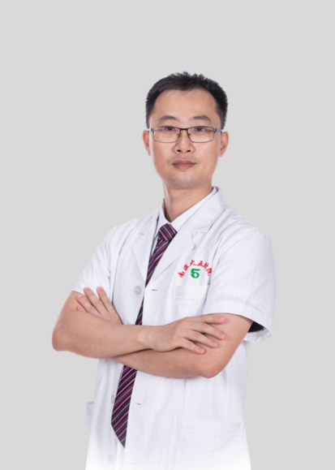

<!-- AUTO-GENERATED-BY: work/generate_obsidian_profiles.py -->

<!-- TEMPLATE: D:\workspace\信息收集整理\医生画像仓库\模板\医生画像模板.md -->

# 卢海宾

## 基础信息

| 字段 | 内容 |
|---|---|
| 姓名 | 卢海宾 |
| 医院 | 南方医科大学第五附属医院 |
| 科室 | 口腔科 |
| 职称/身份 | 副主任医师、博士、口腔种植专家、硕士生导师、岭南名医、羊城青年好医生 |
| 来源链接 | [官网原文](http://www.ny5y.cn/yisheng_xq.php?id=338) |
| 采集日期 | 2026-08-12 |

## 简介/擅长

擅长复杂牙列缺损的种植修复、全口无牙颌种植修复（即刻负重）、即刻种植、微创种植、微创拔牙、牙周手术等。

## 科研项目与成果

- 主持国家自然科学基金、广东省自然科学基金、广东省医学科研基金多项，以第一作者或通讯作者发表 SCI 论文 7 篇。

## 论文与学术产出

- 主持国家自然科学基金、广东省自然科学基金、广东省医学科研基金多项，以第一作者或通讯作者发表 SCI 论文 7 篇。

## 可包装亮点

- 岭南名医 博士，副主任医师，口腔种植专家，硕士生导师，南方医科大学第五附属医院口腔医学中心主任。
- 现任中华口腔医学会种植专业委员会青年委员、广东省临床医学学会牙种植专业委员会委员、广东省医学教育委员会口腔种植专委会委员。
- 主持国家自然科学基金、广东省自然科学基金、广东省医学科研基金多项，以第一作者或通讯作者发表 SCI 论文 7 篇。
- 2016 年获第五届 BITC 口腔种植病例大奖赛全国总决赛银奖， 2018 年获第四届全国牙种植相关骨增量技术应用优秀病例大奖赛一等奖， 2019 年获第八届 BITC 口腔种植病例大奖赛（骨增量专题）广州赛区一等奖。

## 重点疾病/人群标签

- 慢性病：
- 肿瘤：
- 生殖疾病：
- 免疫/风湿：
- 术后恢复/康复：
- 疑难重症：复杂

## 证据摘录

> 只摘录官网公开信息中的短句或关键字段，不复制大段原文。

- 官网身份字段：副主任医师、博士、口腔种植专家、硕士生导师、岭南名医、羊城青年好医生
- 官网简介/擅长：擅长复杂牙列缺损的种植修复、全口无牙颌种植修复（即刻负重）、即刻种植、微创种植、微创拔牙、牙周手术等。
- 官网亮眼经历线索：岭南名医 博士，副主任医师，口腔种植专家，硕士生导师，南方医科大学第五附属医院口腔医学中心主任。 现任中华口腔医学会种植专业委员会青年委员、广东省临床医学学会牙种植专业委员会委员、广东省医学教育委员会口腔种植专委会委员。 主持国家自然科学基金、广东省自然科学基金、广东省医学科研基金多项，以第一作者或通讯作者发表 SCI 论文 7 篇。 2016 年获第五届 BITC 口腔种植病例大奖赛全国总决赛银奖， 2018 年获第四届全国牙种植相…
- 来源链接：http://www.ny5y.cn/yisheng_xq.php?id=338

## BD 画像摘要

卢海宾医生可作为疑难重症方向的基础画像候选。后续 BD 使用应继续以官网来源和人工复核为准，不添加疗效承诺或无来源包装。

## 合规边界

- 仅使用医院官网、官方公众号、官方小程序等公开渠道。
- 不采集私人电话、私人微信、家庭住址、患者隐私或非公开排班信息。
- 不写“保证治愈”“疗效第一”“包治疑难杂症”等无法由官网证明的表述。
