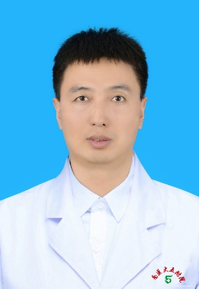

<!-- AUTO-GENERATED-BY: work/generate_obsidian_profiles.py -->

<!-- TEMPLATE: D:\workspace\信息收集整理\医生画像仓库\模板\医生画像模板.md -->

# 孙武平

## 基础信息

| 字段 | 内容 |
|---|---|
| 姓名 | 孙武平 |
| 医院 | 南方医科大学第五附属医院 |
| 科室 | 医学检验科 |
| 职称/身份 | 副研究员、医学博士、博士生导师、博士后合作导师 |
| 来源链接 | [官网原文](http://www.ny5y.cn/yisheng_xq.php?id=560) |
| 采集日期 | 2026-08-12 |

## 简介/擅长

擅长临床生化和分子诊断，承担《临床生物化学》、《检验仪器学》等理论课程授课

## 教育与进修经历

- 副研究员、医学博士、博士生导师、博士后合作导师，日本综合研究大学院大学博士，日本国立生理学研究所博士后。
- 奥地利科学与技术研究所访问学者。

## 科研项目与成果

- 主持国自然面上、青年项目及省市级科研课题10余项，发表SCI论文60余篇，参编英文专著2部，申请及获批多项发明专利和实用新型专利。
- 主要从事神经系统疾病诊断及其发病机制研究，担任多个SCI期刊编辑和审稿人，同时为国自然以及省市级科研项目评审专家。

## 论文与学术产出

- 主持国自然面上、青年项目及省市级科研课题10余项，发表SCI论文60余篇，参编英文专著2部，申请及获批多项发明专利和实用新型专利。
- 主要从事神经系统疾病诊断及其发病机制研究，担任多个SCI期刊编辑和审稿人，同时为国自然以及省市级科研项目评审专家。

## 可包装亮点

- 副研究员、医学博士、博士生导师、博士后合作导师，日本综合研究大学院大学博士，日本国立生理学研究所博士后。
- 奥地利科学与技术研究所访问学者。
- 广东省“珠江人才”青年拔尖人才、深圳市“孔雀计划”海外高层次人才。
- 主持国自然面上、青年项目及省市级科研课题10余项，发表SCI论文60余篇，参编英文专著2部，申请及获批多项发明专利和实用新型专利。

## 重点疾病/人群标签

- 慢性病：
- 肿瘤：
- 生殖疾病：
- 免疫/风湿：
- 术后恢复/康复：
- 疑难重症：

## 证据摘录

> 只摘录官网公开信息中的短句或关键字段，不复制大段原文。

- 官网身份字段：副研究员、医学博士、博士生导师、博士后合作导师
- 官网简介/擅长：擅长临床生化和分子诊断，承担《临床生物化学》、《检验仪器学》等理论课程授课
- 官网亮眼经历线索：副研究员、医学博士、博士生导师、博士后合作导师，日本综合研究大学院大学博士，日本国立生理学研究所博士后。 奥地利科学与技术研究所访问学者。 广东省“珠江人才”青年拔尖人才、深圳市“孔雀计划”海外高层次人才。 主持国自然面上、青年项目及省市级科研课题10余项，发表SCI论文60余篇，参编英文专著2部，申请及获批多项发明专利和实用新型专利。
- 来源链接：http://www.ny5y.cn/yisheng_xq.php?id=560

## BD 画像摘要

孙武平医生可作为南方医科大学第五附属医院医学检验科的基础医生资料入库。当前重点方向以总底表标签为准，官网未展示的信息保持空白。

## 合规边界

- 仅使用医院官网、官方公众号、官方小程序等公开渠道。
- 不采集私人电话、私人微信、家庭住址、患者隐私或非公开排班信息。
- 不写“保证治愈”“疗效第一”“包治疑难杂症”等无法由官网证明的表述。
