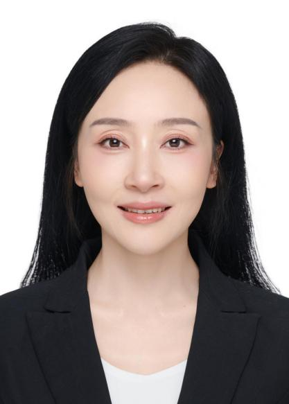

<!-- AUTO-GENERATED-BY: work/generate_obsidian_profiles.py -->

<!-- TEMPLATE: D:\workspace\信息收集整理\医生画像仓库\模板\医生画像模板.md -->

# 宋小萍

## 基础信息

| 字段 | 内容 |
|---|---|
| 姓名 | 宋小萍 |
| 医院 | 南方医科大学第五附属医院 |
| 科室 | 中心实验室 |
| 职称/身份 | 副研究员、医学博士、生物学博士后、硕士研究生导师 |
| 来源链接 | [官网原文](http://www.ny5y.cn/yisheng_xq.php?id=564) |
| 采集日期 | 2026-08-12 |

## 简介/擅长

功能性生物材料与医用水凝胶的设计制备，聚焦模拟细胞外基质微环境，构建具有导电性、免疫调控及促血管生成等功能的智能生物材料体系。长期从事组织工程与再生医学研究，重点开展心肌修复、创伤愈合及组织再生相关功能性水凝胶、生物支架与创伤敷料的开发与转化应用

## 教育与进修经历

- 副研究员、医学博士、生物学博士后、硕士研究生导师， 长期参与科研平台建设与实验室规范化管理工作，现为高校实验室生物安全工作组专家。
- 主持国家自然科学基金、中国博士后科学基金、广东省自然科学基金及广东省医学科研基金等多项科研项目。

## 科研项目与成果

- 副研究员、医学博士、生物学博士后、硕士研究生导师， 长期参与科研平台建设与实验室规范化管理工作，现为高校实验室生物安全工作组专家。
- 兼任中国抗癌协会纳米肿瘤学专业委员会委员、广东省解剖学会委员、中国生物医学工程学会会员、中国医药生物技术协会科研实验室建设与管理分会委员、广东省医学会医学科研实验室建设与管理学会委员等学术职务。
- 已指导研究生15名，在科研组织、平台建设及人才培养方面具有丰富经验。
- 主持国家自然科学基金、中国博士后科学基金、广东省自然科学基金及广东省医学科研基金等多项科研项目。

## 论文与学术产出

- 在《Biomaterials》《Advanced Functional Materials》《Research》《Applied Materials Today》《Theranostics》《Biomaterials Science》等国际期刊发表论文20余篇，获授权国家专利2项。

## 可包装亮点

- 副研究员、医学博士、生物学博士后、硕士研究生导师， 长期参与科研平台建设与实验室规范化管理工作，现为高校实验室生物安全工作组专家。
- 兼任中国抗癌协会纳米肿瘤学专业委员会委员、广东省解剖学会委员、中国生物医学工程学会会员、中国医药生物技术协会科研实验室建设与管理分会委员、广东省医学会医学科研实验室建设与管理学会委员等学术职务。
- 已指导研究生15名，在科研组织、平台建设及人才培养方面具有丰富经验。
- 主持国家自然科学基金、中国博士后科学基金、广东省自然科学基金及广东省医学科研基金等多项科研项目。

## 重点疾病/人群标签

- 慢性病：
- 肿瘤：肿瘤、癌、免疫
- 生殖疾病：
- 免疫/风湿：肿瘤、癌、免疫
- 术后恢复/康复：
- 疑难重症：

## 证据摘录

> 只摘录官网公开信息中的短句或关键字段，不复制大段原文。

- 官网身份字段：副研究员、医学博士、生物学博士后、硕士研究生导师
- 官网简介/擅长：功能性生物材料与医用水凝胶的设计制备，聚焦模拟细胞外基质微环境，构建具有导电性、免疫调控及促血管生成等功能的智能生物材料体系。长期从事组织工程与再生医学研究，重点开展心肌修复、创伤愈合及组织再生相关功能性水凝胶、生物支架与创伤敷料的开发与转化应用
- 官网亮眼经历线索：副研究员、医学博士、生物学博士后、硕士研究生导师， 长期参与科研平台建设与实验室规范化管理工作，现为高校实验室生物安全工作组专家。 兼任中国抗癌协会纳米肿瘤学专业委员会委员、广东省解剖学会委员、中国生物医学工程学会会员、中国医药生物技术协会科研实验室建设与管理分会委员、广东省医学会医学科研实验室建设与管理学会委员等学术职务。 已指导研究生15名，在科研组织、平台建设及人才培养方面具有丰富经验。 主持国家自然科学基金、中国博士后科学基金…
- 来源链接：http://www.ny5y.cn/yisheng_xq.php?id=564

## BD 画像摘要

宋小萍医生可作为肿瘤、免疫/风湿/感染方向的基础画像候选。后续 BD 使用应继续以官网来源和人工复核为准，不添加疗效承诺或无来源包装。

## 合规边界

- 仅使用医院官网、官方公众号、官方小程序等公开渠道。
- 不采集私人电话、私人微信、家庭住址、患者隐私或非公开排班信息。
- 不写“保证治愈”“疗效第一”“包治疑难杂症”等无法由官网证明的表述。
