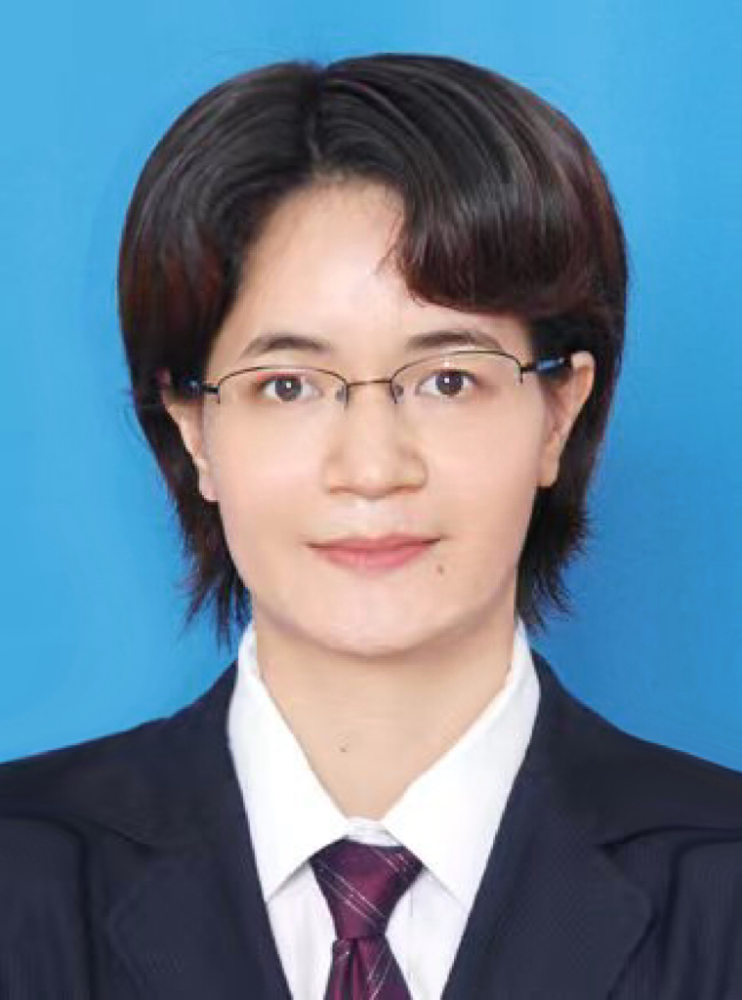

<!-- AUTO-GENERATED-BY: work/generate_obsidian_profiles.py -->

<!-- TEMPLATE: D:\workspace\信息收集整理\医生画像仓库\模板\医生画像模板.md -->

# 庾美玲

## 基础信息

| 字段 | 内容 |
|---|---|
| 姓名 | 庾美玲 |
| 医院 | 南方医科大学第五附属医院 |
| 科室 | 中医科 |
| 职称/身份 | 副主任中医师、岭南名医 |
| 来源链接 | [官网原文](http://www.ny5y.cn/yisheng_xq.php?id=309) |
| 采集日期 | 2026-08-12 |

## 简介/擅长

擅长运用经方治疗月经病、女性不孕不育症、卵巢早衰、习惯性流产、更年期综合征、咳嗽、胃肠疾病、失眠、虚劳及亚健康等疾病有较丰富的临床经验。

## 教育与进修经历

- 毕业于广州中医药大学，从事中西医结合临床工作二十余年。
- 主持并参与省厅级课研课题各1项，表论文多篇，在广东省中医院及广州中医药大学第一附属医院进修学习，师从岭南罗氏妇科全国名中医罗颂平教授和张玉珍教授，跟师南方医科大学南方医院广东省名中医罗仁教授。

## 科研项目与成果

- 主持并参与省厅级课研课题各1项，表论文多篇，在广东省中医院及广州中医药大学第一附属医院进修学习，师从岭南罗氏妇科全国名中医罗颂平教授和张玉珍教授，跟师南方医科大学南方医院广东省名中医罗仁教授。

## 论文与学术产出

- 主持并参与省厅级课研课题各1项，表论文多篇，在广东省中医院及广州中医药大学第一附属医院进修学习，师从岭南罗氏妇科全国名中医罗颂平教授和张玉珍教授，跟师南方医科大学南方医院广东省名中医罗仁教授。

## 可包装亮点

- 岭南名医 主持并参与省厅级课研课题各1项，表论文多篇，在广东省中医院及广州中医药大学第一附属医院进修学习，师从岭南罗氏妇科全国名中医罗颂平教授和张玉珍教授，跟师南方医科大学南方医院广东省名中医罗仁教授。

## 重点疾病/人群标签

- 慢性病：
- 肿瘤：
- 生殖疾病：不孕、卵巢、月经
- 免疫/风湿：
- 术后恢复/康复：
- 疑难重症：

## 证据摘录

> 只摘录官网公开信息中的短句或关键字段，不复制大段原文。

- 官网身份字段：副主任中医师、岭南名医
- 官网简介/擅长：擅长运用经方治疗月经病、女性不孕不育症、卵巢早衰、习惯性流产、更年期综合征、咳嗽、胃肠疾病、失眠、虚劳及亚健康等疾病有较丰富的临床经验。
- 官网亮眼经历线索：岭南名医 主持并参与省厅级课研课题各1项，表论文多篇，在广东省中医院及广州中医药大学第一附属医院进修学习，师从岭南罗氏妇科全国名中医罗颂平教授和张玉珍教授，跟师南方医科大学南方医院广东省名中医罗仁教授。
- 来源链接：http://www.ny5y.cn/yisheng_xq.php?id=309

## BD 画像摘要

庾美玲医生可作为生殖疾病方向的基础画像候选。后续 BD 使用应继续以官网来源和人工复核为准，不添加疗效承诺或无来源包装。

## 合规边界

- 仅使用医院官网、官方公众号、官方小程序等公开渠道。
- 不采集私人电话、私人微信、家庭住址、患者隐私或非公开排班信息。
- 不写“保证治愈”“疗效第一”“包治疑难杂症”等无法由官网证明的表述。
