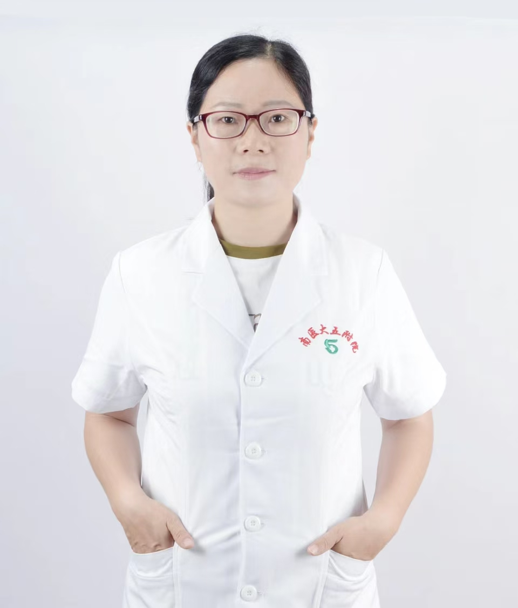

<!-- AUTO-GENERATED-BY: work/generate_obsidian_profiles.py -->

<!-- TEMPLATE: D:\workspace\信息收集整理\医生画像仓库\模板\医生画像模板.md -->

# 徐焱尧

## 基础信息

| 字段 | 内容 |
|---|---|
| 姓名 | 徐焱尧 |
| 医院 | 南方医科大学第五附属医院 |
| 科室 | 普通外科 |
| 职称/身份 | 副主任医师、医学硕士、岭南名医 |
| 来源链接 | [官网原文](http://www.ny5y.cn/yisheng_xq.php?id=555) |
| 采集日期 | 2026-08-12 |

## 简介/擅长

痔病的规范化及微创治疗；内痔、外痔、混合痔（内痔注射治疗、内痔套扎术、混合痔外剥内扎术、PPH术）、肛周脓肿、肛瘘、肛裂、肛门直肠狭窄、肛管息肉、肛门瘙痒症，便秘、炎症性肠病、肛门坠胀等肛肠疾病的中西医结合治疗；结直肠肿瘤的筛查。

## 教育与进修经历

- 毕业于湖南中医药大学 ，从事肛肠临床工作15年，曾在湖南省人民医院、上海长海医院进修学习。

## 可包装亮点

- 岭南名医 毕业于湖南中医药大学 ，从事肛肠临床工作15年，曾在湖南省人民医院、上海长海医院进修学习。

## 重点疾病/人群标签

- 慢性病：
- 肿瘤：肿瘤
- 生殖疾病：
- 免疫/风湿：
- 术后恢复/康复：
- 疑难重症：

## 证据摘录

> 只摘录官网公开信息中的短句或关键字段，不复制大段原文。

- 官网身份字段：副主任医师、医学硕士、岭南名医
- 官网简介/擅长：痔病的规范化及微创治疗；内痔、外痔、混合痔（内痔注射治疗、内痔套扎术、混合痔外剥内扎术、PPH术）、肛周脓肿、肛瘘、肛裂、肛门直肠狭窄、肛管息肉、肛门瘙痒症，便秘、炎症性肠病、肛门坠胀等肛肠疾病的中西医结合治疗；结直肠肿瘤的筛查。
- 官网亮眼经历线索：岭南名医 毕业于湖南中医药大学 ，从事肛肠临床工作15年，曾在湖南省人民医院、上海长海医院进修学习。
- 来源链接：http://www.ny5y.cn/yisheng_xq.php?id=555

## BD 画像摘要

徐焱尧医生可作为肿瘤方向的基础画像候选。后续 BD 使用应继续以官网来源和人工复核为准，不添加疗效承诺或无来源包装。

## 合规边界

- 仅使用医院官网、官方公众号、官方小程序等公开渠道。
- 不采集私人电话、私人微信、家庭住址、患者隐私或非公开排班信息。
- 不写“保证治愈”“疗效第一”“包治疑难杂症”等无法由官网证明的表述。
