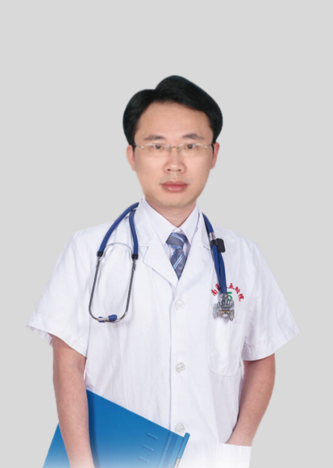

<!-- AUTO-GENERATED-BY: work/generate_obsidian_profiles.py -->

<!-- TEMPLATE: D:\workspace\信息收集整理\医生画像仓库\模板\医生画像模板.md -->

# 曾世彬

## 基础信息

| 字段 | 内容 |
|---|---|
| 姓名 | 曾世彬 |
| 医院 | 南方医科大学第五附属医院 |
| 科室 | 肿瘤科 |
| 职称/身份 | 副主任医师、医学博士 |
| 来源链接 | [官网原文](http://www.ny5y.cn/yisheng_xq.php?id=475) |
| 采集日期 | 2026-08-12 |

## 简介/擅长

擅长各系统恶性肿瘤的精准放射治疗，包括术前、术后放疗，姑息性放疗，肿瘤综合治疗，包括传统化疗、分子靶向、免疫治疗等。对头颈部癌，肺癌，食管癌、乳腺癌，胃癌，肠癌，肝癌等癌症诊治有丰富的临床经验。

## 论文与学术产出

- 在广州、上海多家肿瘤专科医院交流学习，国内外发表论文10余篇。

## 可包装亮点

- 现任广州市医学会放射治疗分会委员、江西省放疗专业委员会青委、中国医药教育江西乳腺专委会委员、江西省整合医学会精准医学会委员、江西省医师协会疼痛专业委员会委员、江西省抗癌协会化疗分委会委员。
- 在广州、上海多家肿瘤专科医院交流学习，国内外发表论文10余篇。

## 重点疾病/人群标签

- 慢性病：
- 肿瘤：肿瘤、癌、放疗、化疗、靶向、肺癌、肝癌、胃癌、肠癌、乳腺癌、免疫、术后、姑息、疼痛
- 生殖疾病：
- 免疫/风湿：肿瘤、癌、放疗、化疗、靶向、肺癌、肝癌、胃癌、肠癌、乳腺癌、免疫、术后、姑息、疼痛
- 术后恢复/康复：肿瘤、癌、放疗、化疗、靶向、肺癌、肝癌、胃癌、肠癌、乳腺癌、免疫、术后、姑息、疼痛
- 疑难重症：

## 证据摘录

> 只摘录官网公开信息中的短句或关键字段，不复制大段原文。

- 官网身份字段：副主任医师、医学博士
- 官网简介/擅长：擅长各系统恶性肿瘤的精准放射治疗，包括术前、术后放疗，姑息性放疗，肿瘤综合治疗，包括传统化疗、分子靶向、免疫治疗等。对头颈部癌，肺癌，食管癌、乳腺癌，胃癌，肠癌，肝癌等癌症诊治有丰富的临床经验。
- 官网亮眼经历线索：现任广州市医学会放射治疗分会委员、江西省放疗专业委员会青委、中国医药教育江西乳腺专委会委员、江西省整合医学会精准医学会委员、江西省医师协会疼痛专业委员会委员、江西省抗癌协会化疗分委会委员。 在广州、上海多家肿瘤专科医院交流学习，国内外发表论文10余篇。
- 来源链接：http://www.ny5y.cn/yisheng_xq.php?id=475

## BD 画像摘要

曾世彬医生可作为肿瘤、免疫/风湿/感染、术后恢复/康复方向的基础画像候选。后续 BD 使用应继续以官网来源和人工复核为准，不添加疗效承诺或无来源包装。

## 合规边界

- 仅使用医院官网、官方公众号、官方小程序等公开渠道。
- 不采集私人电话、私人微信、家庭住址、患者隐私或非公开排班信息。
- 不写“保证治愈”“疗效第一”“包治疑难杂症”等无法由官网证明的表述。
