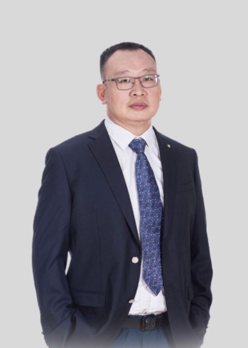

<!-- AUTO-GENERATED-BY: work/generate_obsidian_profiles.py -->

<!-- TEMPLATE: D:\workspace\信息收集整理\医生画像仓库\模板\医生画像模板.md -->

# 李清

## 基础信息

| 字段 | 内容 |
|---|---|
| 姓名 | 李清 |
| 医院 | 南方医科大学第五附属医院 |
| 科室 | 泌尿外科 |
| 职称/身份 | 医学博士、主任医师、博士研究生导师、博士后合作导师、岭南名医、羊城好医生 |
| 来源链接 | [官网原文](http://www.ny5y.cn/yisheng_xq.php?id=335) |
| 采集日期 | 2026-08-12 |

## 简介/擅长

擅长泌尿外科各类复杂结石、肿瘤、畸形的高难度手术,如腹腔镜下膀胱癌根治切除原位回肠代膀胱术、前列腺癌根治术、肾上腺肿瘤摘除术、肾癌根治术、肾部分切除术、输尿管癌根治术、经皮肾穿刺造瘘取石术、输尿管软镜碎石取石术、经尿道前列腺半导体激光剜切术等。

## 教育与进修经历

- 泌尿外科主任，泌尿外科微创技术领域专家，医学博士，三级主任医师，博士研究生导师，博士后合作导师，羊城好医生，岭南名医。

## 科研项目与成果

- 现担任广东省泌尿生殖协会激光医学分会主任委员、广东省医学会泌尿外科分会委员、广州地区泌尿外科质量控制中心专家组委员、广东省抗癌协会泌尿生殖系肿瘤专业委员会委员、广东省医院协会泌尿外科专业委员会常务委员，先后主持和主参国家级和省市级课题20余项，在核心期刊发表论文30余篇、SCI收录10余篇、主编著作2部。

## 论文与学术产出

- 现担任广东省泌尿生殖协会激光医学分会主任委员、广东省医学会泌尿外科分会委员、广州地区泌尿外科质量控制中心专家组委员、广东省抗癌协会泌尿生殖系肿瘤专业委员会委员、广东省医院协会泌尿外科专业委员会常务委员，先后主持和主参国家级和省市级课题20余项，在核心期刊发表论文30余篇、SCI收录10余篇、主编著作2部。

## 可包装亮点

- 岭南名医 泌尿外科主任，泌尿外科微创技术领域专家，医学博士，三级主任医师，博士研究生导师，博士后合作导师，羊城好医生，岭南名医。
- 现担任广东省泌尿生殖协会激光医学分会主任委员、广东省医学会泌尿外科分会委员、广州地区泌尿外科质量控制中心专家组委员、广东省抗癌协会泌尿生殖系肿瘤专业委员会委员、广东省医院协会泌尿外科专业委员会常务委员，先后主持和主参国家级和省市级课题20余项，在核心期刊发表论文30余篇、SCI收录10余篇、主编著作2部。
- 对各类复杂、疑难泌尿外科疾病的诊治具有很高造诣，擅长泌尿外科各类复杂结石、肿瘤、畸形的高难度手术,如腹腔镜下膀胱癌根治切除原位回肠代膀胱术、前列腺癌根治术、肾上腺肿瘤摘除术、肾癌根治术、肾部分切除术、输尿管癌根治术、经皮肾穿刺造瘘取石术、输尿管软镜碎石取石术、经尿道前列腺半导体激光剜切术等。

## 重点疾病/人群标签

- 慢性病：
- 肿瘤：肿瘤、癌、生殖、疑难、复杂
- 生殖疾病：肿瘤、癌、生殖、疑难、复杂
- 免疫/风湿：
- 术后恢复/康复：
- 疑难重症：肿瘤、癌、生殖、疑难、复杂

## 证据摘录

> 只摘录官网公开信息中的短句或关键字段，不复制大段原文。

- 官网身份字段：医学博士、主任医师、博士研究生导师、博士后合作导师、岭南名医、羊城好医生
- 官网简介/擅长：擅长泌尿外科各类复杂结石、肿瘤、畸形的高难度手术,如腹腔镜下膀胱癌根治切除原位回肠代膀胱术、前列腺癌根治术、肾上腺肿瘤摘除术、肾癌根治术、肾部分切除术、输尿管癌根治术、经皮肾穿刺造瘘取石术、输尿管软镜碎石取石术、经尿道前列腺半导体激光剜切术等。
- 官网亮眼经历线索：岭南名医 泌尿外科主任，泌尿外科微创技术领域专家，医学博士，三级主任医师，博士研究生导师，博士后合作导师，羊城好医生，岭南名医。 现担任广东省泌尿生殖协会激光医学分会主任委员、广东省医学会泌尿外科分会委员、广州地区泌尿外科质量控制中心专家组委员、广东省抗癌协会泌尿生殖系肿瘤专业委员会委员、广东省医院协会泌尿外科专业委员会常务委员，先后主持和主参国家级和省市级课题20余项，在核心期刊发表论文30余篇、SCI收录10余篇、主编著作2部…
- 来源链接：http://www.ny5y.cn/yisheng_xq.php?id=335

## BD 画像摘要

李清医生可作为肿瘤、生殖疾病、疑难重症方向的基础画像候选。后续 BD 使用应继续以官网来源和人工复核为准，不添加疗效承诺或无来源包装。

## 合规边界

- 仅使用医院官网、官方公众号、官方小程序等公开渠道。
- 不采集私人电话、私人微信、家庭住址、患者隐私或非公开排班信息。
- 不写“保证治愈”“疗效第一”“包治疑难杂症”等无法由官网证明的表述。
