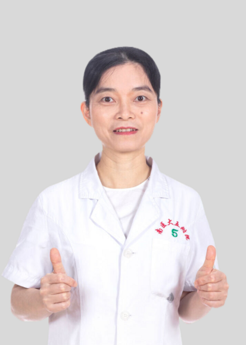

<!-- AUTO-GENERATED-BY: work/generate_obsidian_profiles.py -->

<!-- TEMPLATE: D:\workspace\信息收集整理\医生画像仓库\模板\医生画像模板.md -->

# 林海燕

## 基础信息

| 字段 | 内容 |
|---|---|
| 姓名 | 林海燕 |
| 医院 | 南方医科大学第五附属医院 |
| 科室 | 妇科 |
| 职称/身份 | 副主任医师、十佳医生、 岭南名医 |
| 来源链接 | [官网原文](http://www.ny5y.cn/yisheng_xq.php?id=246) |
| 采集日期 | 2026-08-12 |

## 简介/擅长

妇科良恶性肿瘤、内异症、异常子宫出血、妇科内分泌、不孕不育、顽固妇科炎症等诊治，尤其对妇科肿瘤、异常子宫出血、内分泌、宫腹腔镜微创手术具有丰富的临床经验。

## 教育与进修经历

- 毕业于广州医科大学，从事妇产科工作20余年，曾在广州医科大学第三附属医院妇产科进修学习一年。

## 科研项目与成果

- 曾获广州市卫生局科技立项一项，参与多项省级，市级课题。
- 发表省级、市级课题文章多篇。

## 论文与学术产出

- 发表省级、市级课题文章多篇。

## 可包装亮点

- 岭南名医 副主任医师、十佳医生、岭南名医。
- 毕业于广州医科大学，从事妇产科工作20余年，曾在广州医科大学第三附属医院妇产科进修学习一年。
- 担任广东省中西医结合学会微创外科专业委员会第一届委员会委员、广东省精准医学会应用学会妇科肿瘤分会委员、广东省健康管理学会女性整体健康促进专业委员会常务委员。
- 发表省级、市级课题文章多篇。

## 重点疾病/人群标签

- 慢性病：
- 肿瘤：肿瘤、不孕、妇科内分泌
- 生殖疾病：肿瘤、不孕、妇科内分泌
- 免疫/风湿：
- 术后恢复/康复：
- 疑难重症：

## 证据摘录

> 只摘录官网公开信息中的短句或关键字段，不复制大段原文。

- 官网身份字段：副主任医师、十佳医生、 岭南名医
- 官网简介/擅长：妇科良恶性肿瘤、内异症、异常子宫出血、妇科内分泌、不孕不育、顽固妇科炎症等诊治，尤其对妇科肿瘤、异常子宫出血、内分泌、宫腹腔镜微创手术具有丰富的临床经验。
- 官网亮眼经历线索：岭南名医 副主任医师、十佳医生、岭南名医。 毕业于广州医科大学，从事妇产科工作20余年，曾在广州医科大学第三附属医院妇产科进修学习一年。 担任广东省中西医结合学会微创外科专业委员会第一届委员会委员、广东省精准医学会应用学会妇科肿瘤分会委员、广东省健康管理学会女性整体健康促进专业委员会常务委员。 发表省级、市级课题文章多篇。
- 来源链接：http://www.ny5y.cn/yisheng_xq.php?id=246

## BD 画像摘要

林海燕医生可作为肿瘤、生殖疾病方向的基础画像候选。后续 BD 使用应继续以官网来源和人工复核为准，不添加疗效承诺或无来源包装。

## 合规边界

- 仅使用医院官网、官方公众号、官方小程序等公开渠道。
- 不采集私人电话、私人微信、家庭住址、患者隐私或非公开排班信息。
- 不写“保证治愈”“疗效第一”“包治疑难杂症”等无法由官网证明的表述。
