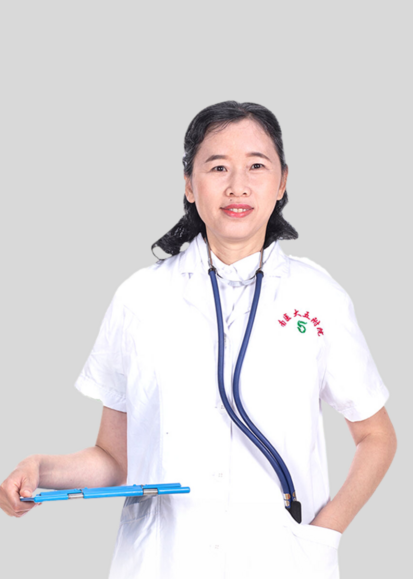

<!-- AUTO-GENERATED-BY: work/generate_obsidian_profiles.py -->

<!-- TEMPLATE: D:\workspace\信息收集整理\医生画像仓库\模板\医生画像模板.md -->

# 肖芬球

## 基础信息

| 字段 | 内容 |
|---|---|
| 姓名 | 肖芬球 |
| 医院 | 南方医科大学第五附属医院 |
| 科室 | 妇科 |
| 职称/身份 | 副主任医师 |
| 来源链接 | [官网原文](http://www.ny5y.cn/yisheng_xq.php?id=241) |
| 采集日期 | 2026-08-12 |

## 简介/擅长

擅长对不孕不育症、反复流产及生殖内分泌等妇科疾病的治疗；对产前诊断和生殖科学有较深研究；在妇科肿瘤、腔镜微创手术方面有丰富的临床经验。

## 教育与进修经历

- 汕头大学医学院临床医疗毕业，从事妇产科临床医疗工作 20余年。
- 曾在广东省妇幼医院产前诊疗及遗传咨询门诊进修。

## 可包装亮点

- 曾在广东省妇幼医院产前诊疗及遗传咨询门诊进修。
- 任 广东省健康管理学会会员。

## 重点疾病/人群标签

- 慢性病：
- 肿瘤：肿瘤、生殖、不孕
- 生殖疾病：肿瘤、生殖、不孕
- 免疫/风湿：
- 术后恢复/康复：
- 疑难重症：

## 证据摘录

> 只摘录官网公开信息中的短句或关键字段，不复制大段原文。

- 官网身份字段：副主任医师
- 官网简介/擅长：擅长对不孕不育症、反复流产及生殖内分泌等妇科疾病的治疗；对产前诊断和生殖科学有较深研究；在妇科肿瘤、腔镜微创手术方面有丰富的临床经验。
- 官网亮眼经历线索：曾在广东省妇幼医院产前诊疗及遗传咨询门诊进修。 任 广东省健康管理学会会员。
- 来源链接：http://www.ny5y.cn/yisheng_xq.php?id=241

## BD 画像摘要

肖芬球医生可作为肿瘤、生殖疾病方向的基础画像候选。后续 BD 使用应继续以官网来源和人工复核为准，不添加疗效承诺或无来源包装。

## 合规边界

- 仅使用医院官网、官方公众号、官方小程序等公开渠道。
- 不采集私人电话、私人微信、家庭住址、患者隐私或非公开排班信息。
- 不写“保证治愈”“疗效第一”“包治疑难杂症”等无法由官网证明的表述。
