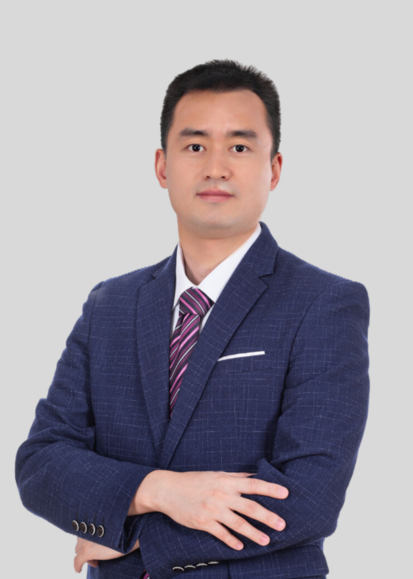

<!-- AUTO-GENERATED-BY: work/generate_obsidian_profiles.py -->

<!-- TEMPLATE: D:\workspace\信息收集整理\医生画像仓库\模板\医生画像模板.md -->

# 胡全福

## 基础信息

| 字段 | 内容 |
|---|---|
| 姓名 | 胡全福 |
| 医院 | 南方医科大学第五附属医院 |
| 科室 | 耳鼻咽喉科 |
| 职称/身份 | 副主任医师、医学硕士、岭南名医 |
| 来源链接 | [官网原文](http://www.ny5y.cn/yisheng_xq.php?id=238) |
| 采集日期 | 2026-08-12 |

## 简介/擅长

擅长咽喉头颈肿瘤、鼾症、声带疾病、鼻-鼻窦疾病的诊治，对眩晕、咽喉反流的诊治经验丰富,尤其是内镜下腺样体切除术、扁桃体切除术，腭咽成型术，鼻内镜下微创鼻窦手术、鼻中隔偏曲矫正术，显微镜下喉部疾病的微创激光手术（如声带息肉、声带囊肿、早期喉癌等），鼻窦、颈部肿瘤的切除及颈淋巴结清扫术。

## 教育与进修经历

- 耳鼻咽喉科硕士，副主任医师，毕业于广州医科大学，从事耳鼻咽喉科临床工作15年。
- 曾于广东省人民医院耳鼻咽喉头颈外科、南方医院睡眠医学中心进修学习，后于北京同仁医院进修学习头颈肿瘤的综合治疗。

## 科研项目与成果

- 参与省级科研课题 2 项，独立完成院级课题 1 项，发表论文 5 篇。

## 论文与学术产出

- 参与省级科研课题 2 项，独立完成院级课题 1 项，发表论文 5 篇。

## 可包装亮点

- 岭南名医 耳鼻咽喉科硕士，副主任医师，毕业于广州医科大学，从事耳鼻咽喉科临床工作15年。
- 曾于广东省人民医院耳鼻咽喉头颈外科、南方医院睡眠医学中心进修学习，后于北京同仁医院进修学习头颈肿瘤的综合治疗。
- 现任广东省临床医学会咽喉肿瘤专业委员会委员；
- 广州抗癌协会从化肿瘤专科分会常务委员；

## 重点疾病/人群标签

- 慢性病：
- 肿瘤：肿瘤、癌
- 生殖疾病：
- 免疫/风湿：
- 术后恢复/康复：
- 疑难重症：

## 证据摘录

> 只摘录官网公开信息中的短句或关键字段，不复制大段原文。

- 官网身份字段：副主任医师、医学硕士、岭南名医
- 官网简介/擅长：擅长咽喉头颈肿瘤、鼾症、声带疾病、鼻-鼻窦疾病的诊治，对眩晕、咽喉反流的诊治经验丰富,尤其是内镜下腺样体切除术、扁桃体切除术，腭咽成型术，鼻内镜下微创鼻窦手术、鼻中隔偏曲矫正术，显微镜下喉部疾病的微创激光手术（如声带息肉、声带囊肿、早期喉癌等），鼻窦、颈部肿瘤的切除及颈淋巴结清扫术。
- 官网亮眼经历线索：岭南名医 耳鼻咽喉科硕士，副主任医师，毕业于广州医科大学，从事耳鼻咽喉科临床工作15年。 曾于广东省人民医院耳鼻咽喉头颈外科、南方医院睡眠医学中心进修学习，后于北京同仁医院进修学习头颈肿瘤的综合治疗。 现任广东省临床医学会咽喉肿瘤专业委员会委员； 广州抗癌协会从化肿瘤专科分会常务委员；
- 来源链接：http://www.ny5y.cn/yisheng_xq.php?id=238

## BD 画像摘要

胡全福医生可作为肿瘤方向的基础画像候选。后续 BD 使用应继续以官网来源和人工复核为准，不添加疗效承诺或无来源包装。

## 合规边界

- 仅使用医院官网、官方公众号、官方小程序等公开渠道。
- 不采集私人电话、私人微信、家庭住址、患者隐私或非公开排班信息。
- 不写“保证治愈”“疗效第一”“包治疑难杂症”等无法由官网证明的表述。
