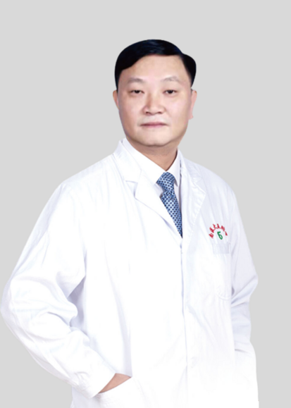

<!-- AUTO-GENERATED-BY: work/generate_obsidian_profiles.py -->

<!-- TEMPLATE: D:\workspace\信息收集整理\医生画像仓库\模板\医生画像模板.md -->

# 蔡庆勇

## 基础信息

| 字段 | 内容 |
|---|---|
| 姓名 | 蔡庆勇 |
| 医院 | 南方医科大学第五附属医院 |
| 科室 | 胸心外科 |
| 职称/身份 | 主任医师、医学博士、教授、硕士研究生导师、岭南名医 |
| 来源链接 | [官网原文](http://www.ny5y.cn/yisheng_xq.php?id=469) |
| 采集日期 | 2026-08-12 |

## 简介/擅长

擅长微创（单孔\单操作孔）肺癌、纵隔肿瘤等手术治疗，胸部肿瘤的规范化、多学科的综合治疗、肺实性\肺磨玻璃结节的系统化规范化治疗、胸腔镜手术治疗肺曲霉菌、结核、纵隔、胸外伤、胸腔镜肺叶切除、肺段切除、微创漏斗胸、雷洛综合征的治疗、肺癌单、双袖式肺叶切除、隆突切除、气管肿瘤切除、pancoast肿瘤等手术、剑突下单孔胸腔镜手术、胸腹腔镜联合食管癌根治术、单孔充气式纵膈镜同步腹腔镜食管癌根治术、肺移植手术。

## 教育与进修经历

- 现任广东省医学会胸外科分会常务委员、广东省胸部肿瘤及肺癌多学科治疗专委会常务委员、中华医学会贵州省胸心外科分会常务委员、贵州省胸腔镜协会常务委员、贵州省抗癌学会肿瘤外科专委会常务委员、遵义市胸心外科学会副主任委员、遵义市创伤学会副主任委员、遵义市器官移植学会副主任委员、遵义市胸心血管外科质控中心副主任委员，现担任《中国胸心血管外科临床杂志》、《中华创伤杂志》、《遵义医科大学学报》特聘审稿专家及编委、教育部学位与研究生教育通讯评议专家、贵州省医疗事故鉴定委员会评审专家、贵州省胸心血管外科及胸腔镜医疗质量控制中心专家…

## 科研项目与成果

- 主持国家级及省部级课题近 10 项、主持新技术近 10 项、在国内、国外 SCI 系列期刊上发表论文近 90 篇、培养硕博研究生近 10 名。

## 论文与学术产出

- 主持国家级及省部级课题近 10 项、主持新技术近 10 项、在国内、国外 SCI 系列期刊上发表论文近 90 篇、培养硕博研究生近 10 名。

## 可包装亮点

- 岭南名医 现任广东省医学会胸外科分会常务委员、广东省胸部肿瘤及肺癌多学科治疗专委会常务委员、中华医学会贵州省胸心外科分会常务委员、贵州省胸腔镜协会常务委员、贵州省抗癌学会肿瘤外科专委会常务委员、遵义市胸心外科学会副主任委员、遵义市创伤学会副主任委员、遵义市器官移植学会副主任委员、遵义市胸心血管外科质控中心副主任委员，现担任《中国胸心血管外科临床杂志》、《中…
- 主持国家级及省部级课题近 10 项、主持新技术近 10 项、在国内、国外 SCI 系列期刊上发表论文近 90 篇、培养硕博研究生近 10 名。

## 重点疾病/人群标签

- 慢性病：
- 肿瘤：肿瘤、癌、肺癌、多学科
- 生殖疾病：
- 免疫/风湿：
- 术后恢复/康复：
- 疑难重症：肿瘤、癌、肺癌、多学科

## 证据摘录

> 只摘录官网公开信息中的短句或关键字段，不复制大段原文。

- 官网身份字段：主任医师、医学博士、教授、硕士研究生导师、岭南名医
- 官网简介/擅长：擅长微创（单孔\单操作孔）肺癌、纵隔肿瘤等手术治疗，胸部肿瘤的规范化、多学科的综合治疗、肺实性\肺磨玻璃结节的系统化规范化治疗、胸腔镜手术治疗肺曲霉菌、结核、纵隔、胸外伤、胸腔镜肺叶切除、肺段切除、微创漏斗胸、雷洛综合征的治疗、肺癌单、双袖式肺叶切除、隆突切除、气管肿瘤切除、pancoast肿瘤等手术、剑突下单孔胸腔镜手术、胸腹腔镜联合食管癌根治术、单孔充气式纵膈镜同步腹腔镜食管癌根治术、肺移植手术。
- 官网亮眼经历线索：岭南名医 现任广东省医学会胸外科分会常务委员、广东省胸部肿瘤及肺癌多学科治疗专委会常务委员、中华医学会贵州省胸心外科分会常务委员、贵州省胸腔镜协会常务委员、贵州省抗癌学会肿瘤外科专委会常务委员、遵义市胸心外科学会副主任委员、遵义市创伤学会副主任委员、遵义市器官移植学会副主任委员、遵义市胸心血管外科质控中心副主任委员，现担任《中国胸心血管外科临床杂志》、《中华创伤杂志》、《遵义医科大学学报》特聘审稿专家及编委、教育部学位与研究生教育通讯…
- 来源链接：http://www.ny5y.cn/yisheng_xq.php?id=469

## BD 画像摘要

蔡庆勇医生可作为肿瘤、疑难重症方向的基础画像候选。后续 BD 使用应继续以官网来源和人工复核为准，不添加疗效承诺或无来源包装。

## 合规边界

- 仅使用医院官网、官方公众号、官方小程序等公开渠道。
- 不采集私人电话、私人微信、家庭住址、患者隐私或非公开排班信息。
- 不写“保证治愈”“疗效第一”“包治疑难杂症”等无法由官网证明的表述。
