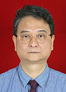

<!-- AUTO-GENERATED-BY: work/generate_obsidian_profiles.py -->

<!-- TEMPLATE: D:\workspace\信息收集整理\医生画像仓库\模板\医生画像模板.md -->

# 乔穗宪

## 基础信息

| 字段 | 内容 |
|---|---|
| 姓名 | 乔穗宪 |
| 医院 | 广东省人民医院 |
| 科室 | 核医学科 |
| 职称/身份 | 主任医师 |
| 来源链接 | [官网原文](https://www.gdghospital.org.cn/Expertlistt/info_itemid_25252_subjectid_63.html) |
| 采集日期 | 2026-08-14 |

## 简介/擅长

1、SPECT/CT检查、影像病例分析、诊断

## 教育与进修经历

- 会诊所需资料 ： 上述专题有关的影像资料和临床检查资料 个人简历 ： 1975年广州医学院毕业 1975-1982年 内科住院医师 1982-1987年 核医学住院医师 1987-1993年 核医学主治医师 1993-2005年 核医学副主任医师 2005年至今 核医学主任医师 工作业绩 ： 核医学SPECT PET临床检查和疾病诊断 应用放射性核素治疗、甲亢、分化型甲状腺癌131I治疗 骨密度测量及骨质疏松诊断 主要论著 （教育与交流）： 1、99mTc-GH素肿瘤把瘤对肝，肺癌诊断评价，临床医学影像杂志， 2…

## 可包装亮点

- 核医学主任医师，中华核医学会临床专业学组成员，广东省核医学会委员，PET诊断组组长 专业专长 ： 1、SPECT/CT检查、影像病例分析、诊断。
- 会诊所需资料 ： 上述专题有关的影像资料和临床检查资料 个人简历 ： 1975年广州医学院毕业 1975-1982年 内科住院医师 1982-1987年 核医学住院医师 1987-1993年 核医学主治医师 1993-2005年 核医学副主任医师 2005年至今 核医学主任医师 工作业绩 ： 核医学SPECT PET临床检查和疾病诊断 应用放射性核素治疗…

## 重点疾病/人群标签

- 慢性病：
- 肿瘤：肿瘤、癌、瘤、肺癌、生殖、类风湿
- 生殖疾病：肿瘤、癌、瘤、肺癌、生殖、类风湿
- 免疫/风湿：肿瘤、癌、瘤、肺癌、生殖、类风湿
- 术后恢复/康复：
- 疑难重症：

## 证据摘录

> 只摘录官网公开信息中的短句或关键字段，不复制大段原文。

- 官网身份字段：主任医师
- 官网简介/擅长：1、SPECT/CT检查、影像病例分析、诊断
- 官网亮眼经历线索：核医学主任医师，中华核医学会临床专业学组成员，广东省核医学会委员，PET诊断组组长 专业专长 ： 1、SPECT/CT检查、影像病例分析、诊断。 会诊所需资料 ： 上述专题有关的影像资料和临床检查资料 个人简历 ： 1975年广州医学院毕业 1975-1982年 内科住院医师 1982-1987年 核医学住院医师 1987-1993年 核医学主治医师 1993-2005年 核医学副主任医师 2005年至今 核医学主任医师 工作业绩 ：…
- 来源链接：https://www.gdghospital.org.cn/Expertlistt/info_itemid_25252_subjectid_63.html

## BD 画像摘要

乔穗宪医生可作为肿瘤、生殖疾病、免疫/风湿/感染方向的基础画像候选。后续 BD 使用应继续以官网来源和人工复核为准，不添加疗效承诺或无来源包装。

## 合规边界

- 仅使用医院官网、官方公众号、官方小程序等公开渠道。
- 不采集私人电话、私人微信、家庭住址、患者隐私或非公开排班信息。
- 不写“保证治愈”“疗效第一”“包治疑难杂症”等无法由官网证明的表述。
