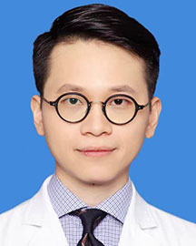

<!-- AUTO-GENERATED-BY: work/generate_obsidian_profiles.py -->

<!-- TEMPLATE: D:\workspace\信息收集整理\医生画像仓库\模板\医生画像模板.md -->

# 任陈

## 基础信息

| 字段 | 内容 |
|---|---|
| 姓名 | 任陈 |
| 医院 | 广东省人民医院 |
| 科室 | 放射治疗科 |
| 职称/身份 | 副主任医师 |
| 来源链接 | [官网原文](https://www.gdghospital.org.cn/Expertlistt/info_itemid_52708_subjectid_31.html) |
| 采集日期 | 2026-08-14 |

## 简介/擅长

中枢、头颈部、骨及软组织、妇科及泌尿生殖系统肿瘤的放射治疗及综合治疗

## 教育与进修经历

- 简介 ：临床医学博士，广东省医师协会放射治疗医师分会委员，毕业后继续教育学组副组长，2020年度中国临床肿瘤学会（CSCO）全国35位最具潜力青年肿瘤医师，主持国家自然科学基金、广东省自然科学基金、广州市科技计划项目，主要研究方向为胶质瘤放疗抵抗及放射性神经损伤机制研究。

## 科研项目与成果

- 简介 ：临床医学博士，广东省医师协会放射治疗医师分会委员，毕业后继续教育学组副组长，2020年度中国临床肿瘤学会（CSCO）全国35位最具潜力青年肿瘤医师，主持国家自然科学基金、广东省自然科学基金、广州市科技计划项目，主要研究方向为胶质瘤放疗抵抗及放射性神经损伤机制研究。

## 可包装亮点

- 简介 ：临床医学博士，广东省医师协会放射治疗医师分会委员，毕业后继续教育学组副组长，2020年度中国临床肿瘤学会（CSCO）全国35位最具潜力青年肿瘤医师，主持国家自然科学基金、广东省自然科学基金、广州市科技计划项目，主要研究方向为胶质瘤放疗抵抗及放射性神经损伤机制研究。

## 重点疾病/人群标签

- 慢性病：
- 肿瘤：肿瘤、瘤、放疗、生殖
- 生殖疾病：肿瘤、瘤、放疗、生殖
- 免疫/风湿：
- 术后恢复/康复：
- 疑难重症：

## 证据摘录

> 只摘录官网公开信息中的短句或关键字段，不复制大段原文。

- 官网身份字段：副主任医师
- 官网简介/擅长：中枢、头颈部、骨及软组织、妇科及泌尿生殖系统肿瘤的放射治疗及综合治疗
- 官网亮眼经历线索：简介 ：临床医学博士，广东省医师协会放射治疗医师分会委员，毕业后继续教育学组副组长，2020年度中国临床肿瘤学会（CSCO）全国35位最具潜力青年肿瘤医师，主持国家自然科学基金、广东省自然科学基金、广州市科技计划项目，主要研究方向为胶质瘤放疗抵抗及放射性神经损伤机制研究。
- 来源链接：https://www.gdghospital.org.cn/Expertlistt/info_itemid_52708_subjectid_31.html

## BD 画像摘要

任陈医生可作为肿瘤、生殖疾病方向的基础画像候选。后续 BD 使用应继续以官网来源和人工复核为准，不添加疗效承诺或无来源包装。

## 合规边界

- 仅使用医院官网、官方公众号、官方小程序等公开渠道。
- 不采集私人电话、私人微信、家庭住址、患者隐私或非公开排班信息。
- 不写“保证治愈”“疗效第一”“包治疑难杂症”等无法由官网证明的表述。
