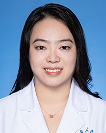

<!-- AUTO-GENERATED-BY: work/generate_obsidian_profiles.py -->

<!-- TEMPLATE: D:\workspace\信息收集整理\医生画像仓库\模板\医生画像模板.md -->

# 伍素卿

## 基础信息

| 字段 | 内容 |
|---|---|
| 姓名 | 伍素卿 |
| 医院 | 广东省人民医院 |
| 科室 | 超声科 |
| 职称/身份 | 医师 |
| 来源链接 | [官网原文](https://www.gdghospital.org.cn/Expertlistt/info_itemid_25293_subjectid_62.html) |
| 采集日期 | 2026-08-14 |

## 简介/擅长

妇科、产科、浅表器官超声诊断 长期从事妇科、产科、浅表器官(乳腺、甲状腺等)，腹部脏器、外周血管等的临床超声工作，具备产前诊断资格证，对胎儿各种畸形、孕期母胎相关疾病有较丰富的诊断经验，擅长妇科疑难病例的超声诊断，掌握妇科三维成像，子宫输卵管造影等新技术的应用

## 教育与进修经历

- 硕士，毕业于华中科技大学同济医学院临床医学七年制专业 专长：妇科、产科、浅表器官超声诊断 长期从事妇科、产科、浅表器官(乳腺、甲状腺等)，腹部脏器、外周血管等的临床超声工作，具备产前诊断资格证，对胎儿各种畸形、孕期母胎相关疾病有较丰富的诊断经验，擅长妇科疑难病例的超声诊断，掌握妇科三维成像，子宫输卵管造影等新技术的应用。

## 科研项目与成果

- 参与发表中、英文期刊论文多篇，参与省、市级课题多项。

## 论文与学术产出

- 参与发表中、英文期刊论文多篇，参与省、市级课题多项。

## 可包装亮点

- 硕士，毕业于华中科技大学同济医学院临床医学七年制专业 专长：妇科、产科、浅表器官超声诊断 长期从事妇科、产科、浅表器官(乳腺、甲状腺等)，腹部脏器、外周血管等的临床超声工作，具备产前诊断资格证，对胎儿各种畸形、孕期母胎相关疾病有较丰富的诊断经验，擅长妇科疑难病例的超声诊断，掌握妇科三维成像，子宫输卵管造影等新技术的应用。
- 参与发表中、英文期刊论文多篇，参与省、市级课题多项。

## 重点疾病/人群标签

- 慢性病：
- 肿瘤：
- 生殖疾病：
- 免疫/风湿：
- 术后恢复/康复：
- 疑难重症：疑难

## 证据摘录

> 只摘录官网公开信息中的短句或关键字段，不复制大段原文。

- 官网身份字段：医师
- 官网简介/擅长：妇科、产科、浅表器官超声诊断 长期从事妇科、产科、浅表器官(乳腺、甲状腺等)，腹部脏器、外周血管等的临床超声工作，具备产前诊断资格证，对胎儿各种畸形、孕期母胎相关疾病有较丰富的诊断经验，擅长妇科疑难病例的超声诊断，掌握妇科三维成像，子宫输卵管造影等新技术的应用
- 官网亮眼经历线索：硕士，毕业于华中科技大学同济医学院临床医学七年制专业 专长：妇科、产科、浅表器官超声诊断 长期从事妇科、产科、浅表器官(乳腺、甲状腺等)，腹部脏器、外周血管等的临床超声工作，具备产前诊断资格证，对胎儿各种畸形、孕期母胎相关疾病有较丰富的诊断经验，擅长妇科疑难病例的超声诊断，掌握妇科三维成像，子宫输卵管造影等新技术的应用。 参与发表中、英文期刊论文多篇，参与省、市级课题多项。
- 来源链接：https://www.gdghospital.org.cn/Expertlistt/info_itemid_25293_subjectid_62.html

## BD 画像摘要

伍素卿医生可作为疑难重症方向的基础画像候选。后续 BD 使用应继续以官网来源和人工复核为准，不添加疗效承诺或无来源包装。

## 合规边界

- 仅使用医院官网、官方公众号、官方小程序等公开渠道。
- 不采集私人电话、私人微信、家庭住址、患者隐私或非公开排班信息。
- 不写“保证治愈”“疗效第一”“包治疑难杂症”等无法由官网证明的表述。
