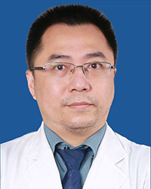

<!-- AUTO-GENERATED-BY: work/generate_obsidian_profiles.py -->

<!-- TEMPLATE: D:\workspace\信息收集整理\医生画像仓库\模板\医生画像模板.md -->

# 何剑辉

## 基础信息

| 字段 | 内容 |
|---|---|
| 姓名 | 何剑辉 |
| 医院 | 广东省人民医院 |
| 科室 | 妇科 |
| 职称/身份 | 副主任医师 |
| 来源链接 | [官网原文](https://www.gdghospital.org.cn/Expertlistt/info_itemid_33005_subjectid_51.html) |
| 采集日期 | 2026-08-14 |

## 简介/擅长

擅长各种妇科良恶性肿瘤的微创治疗及综合治疗，特别是对子宫内膜病变的治疗

## 教育与进修经历

- 中山大学（原中山医科大学）临床医学系毕业，妇产科硕士学 位。

## 论文与学术产出

- 荣誉奖励 广东省健康管理学会妇科肿瘤多学科协作专业委员会副秘书长兼常务委员 广东省健康管理学会女性整体健康促进专业委员会常务委员 广东省医师协会妇产科医师分会青年专业组委员等多个学术团体任职 在国内外的学术期刊上发表多篇学术论文。

## 可包装亮点

- 荣誉奖励 广东省健康管理学会妇科肿瘤多学科协作专业委员会副秘书长兼常务委员 广东省健康管理学会女性整体健康促进专业委员会常务委员 广东省医师协会妇产科医师分会青年专业组委员等多个学术团体任职 在国内外的学术期刊上发表多篇学术论文。

## 重点疾病/人群标签

- 慢性病：
- 肿瘤：肿瘤、瘤、不孕、卵巢、多学科
- 生殖疾病：肿瘤、瘤、不孕、卵巢、多学科
- 免疫/风湿：
- 术后恢复/康复：
- 疑难重症：肿瘤、瘤、不孕、卵巢、多学科

## 证据摘录

> 只摘录官网公开信息中的短句或关键字段，不复制大段原文。

- 官网身份字段：副主任医师
- 官网简介/擅长：擅长各种妇科良恶性肿瘤的微创治疗及综合治疗，特别是对子宫内膜病变的治疗
- 官网亮眼经历线索：荣誉奖励 广东省健康管理学会妇科肿瘤多学科协作专业委员会副秘书长兼常务委员 广东省健康管理学会女性整体健康促进专业委员会常务委员 广东省医师协会妇产科医师分会青年专业组委员等多个学术团体任职 在国内外的学术期刊上发表多篇学术论文。
- 来源链接：https://www.gdghospital.org.cn/Expertlistt/info_itemid_33005_subjectid_51.html

## BD 画像摘要

何剑辉医生可作为肿瘤、生殖疾病、疑难重症方向的基础画像候选。后续 BD 使用应继续以官网来源和人工复核为准，不添加疗效承诺或无来源包装。

## 合规边界

- 仅使用医院官网、官方公众号、官方小程序等公开渠道。
- 不采集私人电话、私人微信、家庭住址、患者隐私或非公开排班信息。
- 不写“保证治愈”“疗效第一”“包治疑难杂症”等无法由官网证明的表述。
