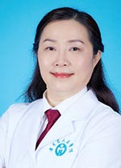

<!-- AUTO-GENERATED-BY: work/generate_obsidian_profiles.py -->

<!-- TEMPLATE: D:\workspace\信息收集整理\医生画像仓库\模板\医生画像模板.md -->

# 何少茹

## 基础信息

| 字段 | 内容 |
|---|---|
| 姓名 | 何少茹 |
| 医院 | 广东省人民医院 |
| 科室 | 新生儿科 |
| 职称/身份 | 主任医师 |
| 来源链接 | [官网原文](https://www.gdghospital.org.cn/Expertlistt/info_itemid_25012_subjectid_56.html) |
| 采集日期 | 2026-08-14 |

## 简介/擅长

## 科研项目与成果

- 论著成果： 《Chin Med J.》、《Early Human Development》、《Journal of Biomaterials and Tissue Engineering》、《中华儿科杂志》、《中华临床儿科杂志》和《中国病理生理杂志》等杂志发表数十篇论著。
- 近3年主持国家自然基金一项、广东省自然基金两项。

## 论文与学术产出

- 论著成果： 《Chin Med J.》、《Early Human Development》、《Journal of Biomaterials and Tissue Engineering》、《中华儿科杂志》、《中华临床儿科杂志》和《中国病理生理杂志》等杂志发表数十篇论著。

## 可包装亮点

- 广东省人民医院儿科首席专家，儿科教授，博士生导师，广东省心血管疾病研究所儿童心脏中心副主任。
- 社会任职： 现任中国医师协会新生儿分行副会长，第二届循环专业委员会主任委员；
- 广东省医师协会新生儿分分会主任委员；
- 广东省医学会儿科分会副主任委员兼新生儿学组组长。

## 重点疾病/人群标签

- 慢性病：
- 肿瘤：
- 生殖疾病：
- 免疫/风湿：
- 术后恢复/康复：
- 疑难重症：危重

## 证据摘录

> 只摘录官网公开信息中的短句或关键字段，不复制大段原文。

- 官网身份字段：主任医师
- 官网亮眼经历线索：广东省人民医院儿科首席专家，儿科教授，博士生导师，广东省心血管疾病研究所儿童心脏中心副主任。 社会任职： 现任中国医师协会新生儿分行副会长，第二届循环专业委员会主任委员； 广东省医师协会新生儿分分会主任委员； 广东省医学会儿科分会副主任委员兼新生儿学组组长。
- 来源链接：https://www.gdghospital.org.cn/Expertlistt/info_itemid_25012_subjectid_56.html

## BD 画像摘要

何少茹医生可作为疑难重症方向的基础画像候选。后续 BD 使用应继续以官网来源和人工复核为准，不添加疗效承诺或无来源包装。

## 合规边界

- 仅使用医院官网、官方公众号、官方小程序等公开渠道。
- 不采集私人电话、私人微信、家庭住址、患者隐私或非公开排班信息。
- 不写“保证治愈”“疗效第一”“包治疑难杂症”等无法由官网证明的表述。
