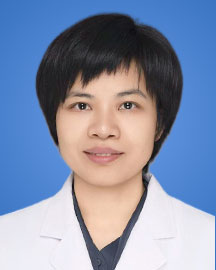

<!-- AUTO-GENERATED-BY: work/generate_obsidian_profiles.py -->

<!-- TEMPLATE: D:\workspace\信息收集整理\医生画像仓库\模板\医生画像模板.md -->

# 何雪桃

## 基础信息

| 字段 | 内容 |
|---|---|
| 姓名 | 何雪桃 |
| 医院 | 广东省人民医院 |
| 科室 | 神经科 |
| 职称/身份 | 主治医师 |
| 来源链接 | [官网原文](https://www.gdghospital.org.cn/Expertlistt/info_itemid_24873_subjectid_44.html) |
| 采集日期 | 2026-08-14 |

## 简介/擅长

对癫痫、重症肌无力、眩晕、脑血管病、周围神经病、肌肉疾病、抽动症、头痛、多发性硬化、视神经脊髓炎、脑炎、认知功能减退、帕金森病等神经科常见病、多发病的诊治具有一定的经验，尤其擅长癫痫、重症肌无力、罕见性周围神经病及肌肉病、头晕等疾病的诊治，特别在难治性癫痫药物及非药物治疗方面有较好的经验

## 论文与学术产出

- 在癫痫、重症肌无力、周围神经病、帕金森病等领域方向发表多篇SCI及中文核心期刊论文，主编出版癫痫专业方向著作1本。

## 可包装亮点

- 在癫痫、重症肌无力、周围神经病、帕金森病等领域方向发表多篇SCI及中文核心期刊论文，主编出版癫痫专业方向著作1本。
- 目前为广东省医师协会神经内科医师分会第六届委员会秘书，广东省中西医结合学神经肌肉疾病及神经电生理专业委员会委员，广东省老年保健协会神经免疫与感染专业委员会青年委员。

## 重点疾病/人群标签

- 慢性病：
- 肿瘤：
- 生殖疾病：
- 免疫/风湿：免疫、感染、重症、难治、罕见
- 术后恢复/康复：
- 疑难重症：免疫、感染、重症、难治、罕见

## 证据摘录

> 只摘录官网公开信息中的短句或关键字段，不复制大段原文。

- 官网身份字段：主治医师
- 官网简介/擅长：对癫痫、重症肌无力、眩晕、脑血管病、周围神经病、肌肉疾病、抽动症、头痛、多发性硬化、视神经脊髓炎、脑炎、认知功能减退、帕金森病等神经科常见病、多发病的诊治具有一定的经验，尤其擅长癫痫、重症肌无力、罕见性周围神经病及肌肉病、头晕等疾病的诊治，特别在难治性癫痫药物及非药物治疗方面有较好的经验
- 官网亮眼经历线索：在癫痫、重症肌无力、周围神经病、帕金森病等领域方向发表多篇SCI及中文核心期刊论文，主编出版癫痫专业方向著作1本。 目前为广东省医师协会神经内科医师分会第六届委员会秘书，广东省中西医结合学神经肌肉疾病及神经电生理专业委员会委员，广东省老年保健协会神经免疫与感染专业委员会青年委员。
- 来源链接：https://www.gdghospital.org.cn/Expertlistt/info_itemid_24873_subjectid_44.html

## BD 画像摘要

何雪桃医生可作为免疫/风湿/感染、疑难重症方向的基础画像候选。后续 BD 使用应继续以官网来源和人工复核为准，不添加疗效承诺或无来源包装。

## 合规边界

- 仅使用医院官网、官方公众号、官方小程序等公开渠道。
- 不采集私人电话、私人微信、家庭住址、患者隐私或非公开排班信息。
- 不写“保证治愈”“疗效第一”“包治疑难杂症”等无法由官网证明的表述。
