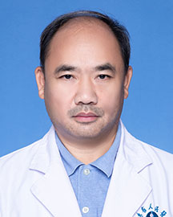

<!-- AUTO-GENERATED-BY: work/generate_obsidian_profiles.py -->

<!-- TEMPLATE: D:\workspace\信息收集整理\医生画像仓库\模板\医生画像模板.md -->

# 何高按

## 基础信息

| 字段 | 内容 |
|---|---|
| 姓名 | 何高按 |
| 医院 | 广东省人民医院 |
| 科室 | 老年呼吸二科 |
| 职称/身份 | 主治医师 |
| 来源链接 | [官网原文](https://www.gdghospital.org.cn/Expertlistt/info_itemid_67150_subjectid_89.html) |
| 采集日期 | 2026-08-14 |

## 简介/擅长

熟练掌握呼吸系统常见病、疑难病、多器官系统疾病的诊治

## 可包装亮点

- 专长 熟练掌握呼吸系统常见病、疑难病、多器官系统疾病的诊治。
- 简介 从事呼吸专科工作20多年，对呼吸系统常见病、疑难病的诊断与治疗有丰富的临 床经验，擅长于肺气肿、慢性阻塞性肺疾病、支气管哮喘、支气管扩张、肺炎、胸 腔积液、间质性肺病、肺结节、肺部阴影，以及其它呼吸系统感染性疾病的诊治。

## 重点疾病/人群标签

- 慢性病：慢性、感染、疑难
- 肿瘤：
- 生殖疾病：
- 免疫/风湿：慢性、感染、疑难
- 术后恢复/康复：
- 疑难重症：慢性、感染、疑难

## 证据摘录

> 只摘录官网公开信息中的短句或关键字段，不复制大段原文。

- 官网身份字段：主治医师
- 官网简介/擅长：熟练掌握呼吸系统常见病、疑难病、多器官系统疾病的诊治
- 官网亮眼经历线索：专长 熟练掌握呼吸系统常见病、疑难病、多器官系统疾病的诊治。 简介 从事呼吸专科工作20多年，对呼吸系统常见病、疑难病的诊断与治疗有丰富的临 床经验，擅长于肺气肿、慢性阻塞性肺疾病、支气管哮喘、支气管扩张、肺炎、胸 腔积液、间质性肺病、肺结节、肺部阴影，以及其它呼吸系统感染性疾病的诊治。
- 来源链接：https://www.gdghospital.org.cn/Expertlistt/info_itemid_67150_subjectid_89.html

## BD 画像摘要

何高按医生可作为慢性病、免疫/风湿/感染、疑难重症方向的基础画像候选。后续 BD 使用应继续以官网来源和人工复核为准，不添加疗效承诺或无来源包装。

## 合规边界

- 仅使用医院官网、官方公众号、官方小程序等公开渠道。
- 不采集私人电话、私人微信、家庭住址、患者隐私或非公开排班信息。
- 不写“保证治愈”“疗效第一”“包治疑难杂症”等无法由官网证明的表述。
