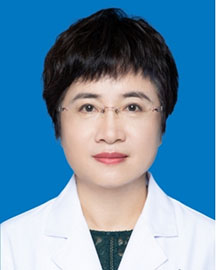

<!-- AUTO-GENERATED-BY: work/generate_obsidian_profiles.py -->

<!-- TEMPLATE: D:\workspace\信息收集整理\医生画像仓库\模板\医生画像模板.md -->

# 余丹青

## 基础信息

| 字段 | 内容 |
|---|---|
| 姓名 | 余丹青 |
| 医院 | 广东省人民医院 |
| 科室 | 心血管内科 |
| 职称/身份 | 主任医师 |
| 来源链接 | [官网原文](https://www.gdghospital.org.cn/Expertlistt/info_itemid_25500_subjectid_79.html) |
| 采集日期 | 2026-08-14 |

## 简介/擅长

心血管专业常见病、多发病如冠心病、高血压、心瓣膜疾病、心力衰竭和心肌病等的诊断和治疗

## 可包装亮点

- 医学博士，博士导师，从事冠心病介入诊疗工作二十多年，年均PCI病例数量超过500例，担任欧洲心脏病学会Fellow（FESC)，美国心脏病学会Fellow（FACC)，中国抗衰老促进会女性健康专业委员会委员，国家老年疾病临床医学研究中心-中国老年心血管病防治联盟第一届委员会委员，中华医学会心血管病学分会女性心脏健康学组委员，中国医师协会心血管内科医师分会科…
- 获得广东省科技进步奖一项。

## 重点疾病/人群标签

- 慢性病：高血压、冠心病、心力衰竭
- 肿瘤：
- 生殖疾病：
- 免疫/风湿：
- 术后恢复/康复：
- 疑难重症：

## 证据摘录

> 只摘录官网公开信息中的短句或关键字段，不复制大段原文。

- 官网身份字段：主任医师
- 官网简介/擅长：心血管专业常见病、多发病如冠心病、高血压、心瓣膜疾病、心力衰竭和心肌病等的诊断和治疗
- 官网亮眼经历线索：医学博士，博士导师，从事冠心病介入诊疗工作二十多年，年均PCI病例数量超过500例，担任欧洲心脏病学会Fellow（FESC)，美国心脏病学会Fellow（FACC)，中国抗衰老促进会女性健康专业委员会委员，国家老年疾病临床医学研究中心-中国老年心血管病防治联盟第一届委员会委员，中华医学会心血管病学分会女性心脏健康学组委员，中国医师协会心血管内科医师分会科普工作委员会委员，广东省介入性心脏病学会理事，广东省介入性心脏病学会女性心血管病…
- 来源链接：https://www.gdghospital.org.cn/Expertlistt/info_itemid_25500_subjectid_79.html

## BD 画像摘要

余丹青医生可作为慢性病方向的基础画像候选。后续 BD 使用应继续以官网来源和人工复核为准，不添加疗效承诺或无来源包装。

## 合规边界

- 仅使用医院官网、官方公众号、官方小程序等公开渠道。
- 不采集私人电话、私人微信、家庭住址、患者隐私或非公开排班信息。
- 不写“保证治愈”“疗效第一”“包治疑难杂症”等无法由官网证明的表述。
