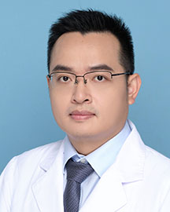

<!-- AUTO-GENERATED-BY: work/generate_obsidian_profiles.py -->

<!-- TEMPLATE: D:\workspace\信息收集整理\医生画像仓库\模板\医生画像模板.md -->

# 余敏

## 基础信息

| 字段 | 内容 |
|---|---|
| 姓名 | 余敏 |
| 医院 | 广东省人民医院 |
| 科室 | 胰腺中心 |
| 职称/身份 | 副主任医师 |
| 来源链接 | [官网原文](https://www.gdghospital.org.cn/Expertlistt/info_itemid_32767_subjectid_106.html) |
| 采集日期 | 2026-08-14 |

## 简介/擅长

于胰腺良恶性肿瘤和肝内外胆管结石、肿瘤的外科治疗

## 教育与进修经历

- 专业特长 ： 毕业于中山大学临床医学八年制，熟练掌握肝胆胰腺外科常见病、多发病的外科诊治，尤其擅长于胰腺良恶性肿瘤和肝内外胆管结石、肿瘤的外科治疗。
- 学术专业领域成就 ： 获得2020年度广东省百名博士博士后创新人物，现以第一作者/通讯作者发表SCI文章25篇，作为项目负责人担任国家自然科学基金（面上、青年）、国家重点研发计划子课题、省级、广州市的科研项目，担任多家国外学术杂志的审稿。

## 科研项目与成果

- 学术专业领域成就 ： 获得2020年度广东省百名博士博士后创新人物，现以第一作者/通讯作者发表SCI文章25篇，作为项目负责人担任国家自然科学基金（面上、青年）、国家重点研发计划子课题、省级、广州市的科研项目，担任多家国外学术杂志的审稿。

## 论文与学术产出

- 学术专业领域成就 ： 获得2020年度广东省百名博士博士后创新人物，现以第一作者/通讯作者发表SCI文章25篇，作为项目负责人担任国家自然科学基金（面上、青年）、国家重点研发计划子课题、省级、广州市的科研项目，担任多家国外学术杂志的审稿。

## 可包装亮点

- 中共党员，医学博士，普通外科秘书 主要社会兼职 ： 中国研究型医院学会肝胆胰外科专业委员会青年委员，广东省抗癌协会胆道肿瘤专业委员会青年委员，广州市抗癌协会消化道肿瘤青年委员会委员，广东省医疗行业协会门静脉高压症管理分会委员。
- 学术专业领域成就 ： 获得2020年度广东省百名博士博士后创新人物，现以第一作者/通讯作者发表SCI文章25篇，作为项目负责人担任国家自然科学基金（面上、青年）、国家重点研发计划子课题、省级、广州市的科研项目，担任多家国外学术杂志的审稿。

## 重点疾病/人群标签

- 慢性病：
- 肿瘤：肿瘤、癌
- 生殖疾病：
- 免疫/风湿：
- 术后恢复/康复：
- 疑难重症：

## 证据摘录

> 只摘录官网公开信息中的短句或关键字段，不复制大段原文。

- 官网身份字段：副主任医师
- 官网简介/擅长：于胰腺良恶性肿瘤和肝内外胆管结石、肿瘤的外科治疗
- 官网亮眼经历线索：中共党员，医学博士，普通外科秘书 主要社会兼职 ： 中国研究型医院学会肝胆胰外科专业委员会青年委员，广东省抗癌协会胆道肿瘤专业委员会青年委员，广州市抗癌协会消化道肿瘤青年委员会委员，广东省医疗行业协会门静脉高压症管理分会委员。 学术专业领域成就 ： 获得2020年度广东省百名博士博士后创新人物，现以第一作者/通讯作者发表SCI文章25篇，作为项目负责人担任国家自然科学基金（面上、青年）、国家重点研发计划子课题、省级、广州市的科研项目…
- 来源链接：https://www.gdghospital.org.cn/Expertlistt/info_itemid_32767_subjectid_106.html

## BD 画像摘要

余敏医生可作为肿瘤方向的基础画像候选。后续 BD 使用应继续以官网来源和人工复核为准，不添加疗效承诺或无来源包装。

## 合规边界

- 仅使用医院官网、官方公众号、官方小程序等公开渠道。
- 不采集私人电话、私人微信、家庭住址、患者隐私或非公开排班信息。
- 不写“保证治愈”“疗效第一”“包治疑难杂症”等无法由官网证明的表述。
