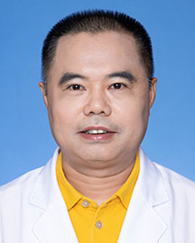

<!-- AUTO-GENERATED-BY: work/generate_obsidian_profiles.py -->

<!-- TEMPLATE: D:\workspace\信息收集整理\医生画像仓库\模板\医生画像模板.md -->

# 全东明

## 基础信息

| 字段 | 内容 |
|---|---|
| 姓名 | 全东明 |
| 医院 | 广东省人民医院 |
| 科室 | 睡眠医学科 |
| 职称/身份 | 副主任医师 科主任 |
| 来源链接 | [官网原文](https://www.gdghospital.org.cn/Expertlistt/info_itemid_56704_subjectid_37.html) |
| 采集日期 | 2026-08-14 |

## 简介/擅长

对睡眠障碍、焦虑抑郁障碍、躯体形式障碍、强迫症诊治

## 教育与进修经历

- 曾到日本进修，曾任第一届广东省法医学会法医精神病学专业委员会委员及秘书、广东省医学会睡眠障碍与相关疾病防治专业委员会委员。

## 科研项目与成果

- 简介 ： 睡眠医学科主任，副主任医师，从事精神卫生及临床工作30余年，主持及参与省医学科学技术研究项目多项。

## 可包装亮点

- 简介 ： 睡眠医学科主任，副主任医师，从事精神卫生及临床工作30余年，主持及参与省医学科学技术研究项目多项。
- 曾到日本进修，曾任第一届广东省法医学会法医精神病学专业委员会委员及秘书、广东省医学会睡眠障碍与相关疾病防治专业委员会委员。

## 重点疾病/人群标签

- 慢性病：
- 肿瘤：
- 生殖疾病：
- 免疫/风湿：
- 术后恢复/康复：
- 疑难重症：

## 证据摘录

> 只摘录官网公开信息中的短句或关键字段，不复制大段原文。

- 官网身份字段：副主任医师 科主任
- 官网简介/擅长：对睡眠障碍、焦虑抑郁障碍、躯体形式障碍、强迫症诊治
- 官网亮眼经历线索：简介 ： 睡眠医学科主任，副主任医师，从事精神卫生及临床工作30余年，主持及参与省医学科学技术研究项目多项。 曾到日本进修，曾任第一届广东省法医学会法医精神病学专业委员会委员及秘书、广东省医学会睡眠障碍与相关疾病防治专业委员会委员。
- 异常提示：同名待甄别
- 来源链接：https://www.gdghospital.org.cn/Expertlistt/info_itemid_56704_subjectid_37.html

## BD 画像摘要

全东明医生可作为广东省人民医院睡眠医学科的基础医生资料入库。当前重点方向以总底表标签为准，官网未展示的信息保持空白。

## 合规边界

- 仅使用医院官网、官方公众号、官方小程序等公开渠道。
- 不采集私人电话、私人微信、家庭住址、患者隐私或非公开排班信息。
- 不写“保证治愈”“疗效第一”“包治疑难杂症”等无法由官网证明的表述。
