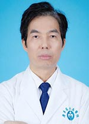

<!-- AUTO-GENERATED-BY: work/generate_obsidian_profiles.py -->

<!-- TEMPLATE: D:\workspace\信息收集整理\医生画像仓库\模板\医生画像模板.md -->

# 农绍汉

## 基础信息

| 字段 | 内容 |
|---|---|
| 姓名 | 农绍汉 |
| 医院 | 广东省人民医院 |
| 科室 | 新生儿科 |
| 职称/身份 | 主任医师 |
| 来源链接 | [官网原文](https://www.gdghospital.org.cn/Expertlistt/info_itemid_23629_subjectid_56.html) |
| 采集日期 | 2026-08-14 |

## 简介/擅长

## 教育与进修经历

- 硕士生导师 1987年本科毕业参加工作，1994年研究生毕业。
- 1997年考取世界卫生组织奖学金，1998/1999年赴澳大利亚悉尼市Royal Prince Alfred Hospital进修学习；
- 2001/2002年考取香港大学Ms Ivy Wu奖学金，在香港大学玛丽医院儿科部进修学习一年。

## 科研项目与成果

- 论著成果： 已主编专业书刊两本，另参与三本专业书籍的编写，已获得国家人事部和广东省重点攻关项目等9项研究课题立项，发表论文四十余篇，其中SCI国际期刊3篇（英文期刊4篇），中华儿科杂志、中华围产医学杂志和中国实用儿科杂志8篇，为“中国当代儿科杂志”、“广东医学”等杂志的审稿专家。

## 论文与学术产出

- 论著成果： 已主编专业书刊两本，另参与三本专业书籍的编写，已获得国家人事部和广东省重点攻关项目等9项研究课题立项，发表论文四十余篇，其中SCI国际期刊3篇（英文期刊4篇），中华儿科杂志、中华围产医学杂志和中国实用儿科杂志8篇，为“中国当代儿科杂志”、“广东医学”等杂志的审稿专家。

## 可包装亮点

- 硕士生导师 1987年本科毕业参加工作，1994年研究生毕业。
- 1997年考取世界卫生组织奖学金，1998/1999年赴澳大利亚悉尼市Royal Prince Alfred Hospital进修学习；
- 2001/2002年考取香港大学Ms Ivy Wu奖学金，在香港大学玛丽医院儿科部进修学习一年。
- 论著成果： 已主编专业书刊两本，另参与三本专业书籍的编写，已获得国家人事部和广东省重点攻关项目等9项研究课题立项，发表论文四十余篇，其中SCI国际期刊3篇（英文期刊4篇），中华儿科杂志、中华围产医学杂志和中国实用儿科杂志8篇，为“中国当代儿科杂志”、“广东医学”等杂志的审稿专家。

## 重点疾病/人群标签

- 慢性病：
- 肿瘤：
- 生殖疾病：
- 免疫/风湿：
- 术后恢复/康复：
- 疑难重症：

## 证据摘录

> 只摘录官网公开信息中的短句或关键字段，不复制大段原文。

- 官网身份字段：主任医师
- 官网亮眼经历线索：硕士生导师 1987年本科毕业参加工作，1994年研究生毕业。 1997年考取世界卫生组织奖学金，1998/1999年赴澳大利亚悉尼市Royal Prince Alfred Hospital进修学习； 2001/2002年考取香港大学Ms Ivy Wu奖学金，在香港大学玛丽医院儿科部进修学习一年。 论著成果： 已主编专业书刊两本，另参与三本专业书籍的编写，已获得国家人事部和广东省重点攻关项目等9项研究课题立项，发表论文四十余篇，其中S…
- 来源链接：https://www.gdghospital.org.cn/Expertlistt/info_itemid_23629_subjectid_56.html

## BD 画像摘要

农绍汉医生可作为广东省人民医院新生儿科的基础医生资料入库。当前重点方向以总底表标签为准，官网未展示的信息保持空白。

## 合规边界

- 仅使用医院官网、官方公众号、官方小程序等公开渠道。
- 不采集私人电话、私人微信、家庭住址、患者隐私或非公开排班信息。
- 不写“保证治愈”“疗效第一”“包治疑难杂症”等无法由官网证明的表述。
