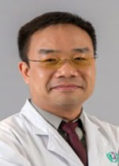

<!-- AUTO-GENERATED-BY: work/generate_obsidian_profiles.py -->

<!-- TEMPLATE: D:\workspace\信息收集整理\医生画像仓库\模板\医生画像模板.md -->

# 凌家炜

## 基础信息

| 字段 | 内容 |
|---|---|
| 姓名 | 凌家炜 |
| 医院 | 广东省人民医院 |
| 科室 | 生殖医学科 |
| 职称/身份 | 副主任医师 |
| 来源链接 | [官网原文](https://www.gdghospital.org.cn/Expertlistt/info_itemid_24853_subjectid_53.html) |
| 采集日期 | 2026-08-14 |

## 简介/擅长

不孕不育、生殖内分泌各种临床疾病的诊断和治疗，熟练掌握人工授精、IVF（试管婴儿）以及胚胎植入前遗传学诊断（俗称“第三代试管婴儿”）的临床和实验室操作

## 教育与进修经历

- 生殖医学医学博士 1996年获中山医科大学临床医学学士学位，1998年获中山医科大学妇产科学硕士学位，师从梅卓贤教授，2008年获中山大学生殖医学博士学位，师从庄广伦教授。
- 2002-2003年获美国Louisiana State University Health Sciences Center at Shreveport, Department of Biochemistry and Molecular Biology 奖学金赴美学习一年，2006年-2007年获国家留学基金委资助，以联合培养博士生身份前往美国康奈尔大学医学院生殖中心进行利用基因芯片对单细胞DNA进行遗传分析的研究，2011年广州医科大学公派前往美国San Francisco State University,…

## 科研项目与成果

- 2002-2003年获美国Louisiana State University Health Sciences Center at Shreveport, Department of Biochemistry and Molecular Biology 奖学金赴美学习一年，2006年-2007年获国家留学基金委资助，以联合培养博士生身份前往美国康奈尔大学医学院生殖中心进行利用基因芯片对单细胞DNA进行遗传分析的研究，2011年广州医科大学公派前往美国San Francisco State University,…
- 从事妇产科以及生殖医学临床、科研和教学工作20余年，擅长不孕不育、生殖内分泌各种临床疾病的诊断和治疗，熟练掌握人工授精、IVF（试管婴儿）以及胚胎植入前遗传学诊断（俗称“第三代试管婴儿”）的临床和实验室操作。
- 在国内外SCI杂志和核心期刊发表论著10余篇，主持以及参与国家级和省市级科研基金多项。

## 论文与学术产出

- 2002-2003年获美国Louisiana State University Health Sciences Center at Shreveport, Department of Biochemistry and Molecular Biology 奖学金赴美学习一年，2006年-2007年获国家留学基金委资助，以联合培养博士生身份前往美国康奈尔大学医学院生殖中心进行利用基因芯片对单细胞DNA进行遗传分析的研究，2011年广州医科大学公派前往美国San Francisco State University,…
- 在国内外SCI杂志和核心期刊发表论著10余篇，主持以及参与国家级和省市级科研基金多项。

## 可包装亮点

- 2002-2003年获美国Louisiana State University Health Sciences Center at Shreveport, Department of Biochemistry and Molecular Biology 奖学金赴美学习一年，2006年-2007年获国家留学基金委资助，以联合培养博士生身份前往美国康奈尔大学医…
- 在国内外SCI杂志和核心期刊发表论著10余篇，主持以及参与国家级和省市级科研基金多项。

## 重点疾病/人群标签

- 慢性病：
- 肿瘤：
- 生殖疾病：生殖、不孕、试管、胚胎
- 免疫/风湿：
- 术后恢复/康复：
- 疑难重症：

## 证据摘录

> 只摘录官网公开信息中的短句或关键字段，不复制大段原文。

- 官网身份字段：副主任医师
- 官网简介/擅长：不孕不育、生殖内分泌各种临床疾病的诊断和治疗，熟练掌握人工授精、IVF（试管婴儿）以及胚胎植入前遗传学诊断（俗称“第三代试管婴儿”）的临床和实验室操作
- 官网亮眼经历线索：2002-2003年获美国Louisiana State University Health Sciences Center at Shreveport, Department of Biochemistry and Molecular Biology 奖学金赴美学习一年，2006年-2007年获国家留学基金委资助，以联合培养博士生身份前往美国康奈尔大学医学院生殖中心进行利用基因芯片对单细胞DNA进行遗传分析的研究，2011年广州医科…
- 来源链接：https://www.gdghospital.org.cn/Expertlistt/info_itemid_24853_subjectid_53.html

## BD 画像摘要

凌家炜医生可作为生殖疾病方向的基础画像候选。后续 BD 使用应继续以官网来源和人工复核为准，不添加疗效承诺或无来源包装。

## 合规边界

- 仅使用医院官网、官方公众号、官方小程序等公开渠道。
- 不采集私人电话、私人微信、家庭住址、患者隐私或非公开排班信息。
- 不写“保证治愈”“疗效第一”“包治疑难杂症”等无法由官网证明的表述。
