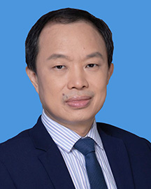

<!-- AUTO-GENERATED-BY: work/generate_obsidian_profiles.py -->

<!-- TEMPLATE: D:\workspace\信息收集整理\医生画像仓库\模板\医生画像模板.md -->

# 刘久敏

## 基础信息

| 字段 | 内容 |
|---|---|
| 姓名 | 刘久敏 |
| 医院 | 广东省人民医院 |
| 科室 | 泌尿外科 |
| 职称/身份 | 主任医师 |
| 来源链接 | [官网原文](https://www.gdghospital.org.cn/Expertlistt/info_itemid_24783_subjectid_7.html) |
| 采集日期 | 2026-08-14 |

## 简介/擅长

前列腺癌、膀胱癌、肾癌等泌尿系肿瘤、泌尿系结石及先天性畸形等疾病诊疗，对泌尿系统疑难危重疾病及男科学、肾移植等具有丰富的临床经验 精通机器人辅助手术、腹腔镜技术、泌尿系结石微创治疗等先进手术技术 学术专业领域成就 主持并参与多项国家级、省部级及全国多中心相关科学项目研究工作 国际国内重要学术杂志发表大量学术论文，兼任多份重要医学核心杂志编委

## 教育与进修经历

- 硕士研究生导师 主要社会兼职 中华医学会泌尿外科分会全国委员 中国医师协会泌尿外科分会全国委员 中国医师协会医学机器人医师分会全国委员 中华医学会泌尿外科分会肿瘤学组委员 中国医师协会泌尿外科分会肿瘤专业委员会委员 广东省医学会泌尿外科分会副主任委员 广东省医师协会泌尿外科分会副主任委员 广东省医学会泌尿外科分会前列腺学组组长 教育经历和专业特长 毕业于中山医科大学 美国Beth Israel Medical Center、University of California, San Francisco及Unive…

## 可包装亮点

- 硕士研究生导师 主要社会兼职 中华医学会泌尿外科分会全国委员 中国医师协会泌尿外科分会全国委员 中国医师协会医学机器人医师分会全国委员 中华医学会泌尿外科分会肿瘤学组委员 中国医师协会泌尿外科分会肿瘤专业委员会委员 广东省医学会泌尿外科分会副主任委员 广东省医师协会泌尿外科分会副主任委员 广东省医学会泌尿外科分会前列腺学组组长 教育经历和专业特长 毕业于中…

## 重点疾病/人群标签

- 慢性病：
- 肿瘤：肿瘤、癌、疑难、危重
- 生殖疾病：
- 免疫/风湿：
- 术后恢复/康复：
- 疑难重症：肿瘤、癌、疑难、危重

## 证据摘录

> 只摘录官网公开信息中的短句或关键字段，不复制大段原文。

- 官网身份字段：主任医师
- 官网简介/擅长：前列腺癌、膀胱癌、肾癌等泌尿系肿瘤、泌尿系结石及先天性畸形等疾病诊疗，对泌尿系统疑难危重疾病及男科学、肾移植等具有丰富的临床经验 精通机器人辅助手术、腹腔镜技术、泌尿系结石微创治疗等先进手术技术 学术专业领域成就 主持并参与多项国家级、省部级及全国多中心相关科学项目研究工作 国际国内重要学术杂志发表大量学术论文，兼任多份重要医学核心杂志编委
- 官网亮眼经历线索：硕士研究生导师 主要社会兼职 中华医学会泌尿外科分会全国委员 中国医师协会泌尿外科分会全国委员 中国医师协会医学机器人医师分会全国委员 中华医学会泌尿外科分会肿瘤学组委员 中国医师协会泌尿外科分会肿瘤专业委员会委员 广东省医学会泌尿外科分会副主任委员 广东省医师协会泌尿外科分会副主任委员 广东省医学会泌尿外科分会前列腺学组组长 教育经历和专业特长 毕业于中山医科大学 美国Beth Israel Medical Center、Unive…
- 来源链接：https://www.gdghospital.org.cn/Expertlistt/info_itemid_24783_subjectid_7.html

## BD 画像摘要

刘久敏医生可作为肿瘤、疑难重症方向的基础画像候选。后续 BD 使用应继续以官网来源和人工复核为准，不添加疗效承诺或无来源包装。

## 合规边界

- 仅使用医院官网、官方公众号、官方小程序等公开渠道。
- 不采集私人电话、私人微信、家庭住址、患者隐私或非公开排班信息。
- 不写“保证治愈”“疗效第一”“包治疑难杂症”等无法由官网证明的表述。
