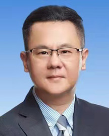

<!-- AUTO-GENERATED-BY: work/generate_obsidian_profiles.py -->

<!-- TEMPLATE: D:\workspace\信息收集整理\医生画像仓库\模板\医生画像模板.md -->

# 刘宇斌

## 基础信息

| 字段 | 内容 |
|---|---|
| 姓名 | 刘宇斌 |
| 医院 | 广东省人民医院 |
| 科室 | 肝胆外科 |
| 职称/身份 | 主任医师 |
| 来源链接 | [官网原文](https://www.gdghospital.org.cn/Expertlistt/info_itemid_24140_subjectid_105.html) |
| 采集日期 | 2026-08-14 |

## 简介/擅长

肝胆胰疾病和普外科疾病的诊断治疗，尤其在肝胆疾病的微创治疗和肝胆肿瘤的综合治疗方面享有较高声誉

## 科研项目与成果

- 学术专业领域成就 ： 主持多项省自然科学，省科技，市科技，省卫健委基金科研项目；
- 曾参与多项国家自然科学基金，863计划和国际合作科研项目；
- 医学发明专利5项；

## 论文与学术产出

- 发表高分SCI文章10多篇，国内核心医学期刊30多篇；
- 主编医学专业书刊4本，参编医学类教科书和教材2本。

## 可包装亮点

- 医学博士，主任医师，博士生导师 主要社会兼职 ： 中华医学会广东省肝胆胰分会胆道学组副组长；
- 中国医师协会广东省肝胆分会副主委；
- 中华医学会广东省数字医学会副主委；
- 中华医学会广东省肝癌分会副主委；

## 重点疾病/人群标签

- 慢性病：
- 肿瘤：肿瘤、肝癌
- 生殖疾病：
- 免疫/风湿：
- 术后恢复/康复：
- 疑难重症：

## 证据摘录

> 只摘录官网公开信息中的短句或关键字段，不复制大段原文。

- 官网身份字段：主任医师
- 官网简介/擅长：肝胆胰疾病和普外科疾病的诊断治疗，尤其在肝胆疾病的微创治疗和肝胆肿瘤的综合治疗方面享有较高声誉
- 官网亮眼经历线索：医学博士，主任医师，博士生导师 主要社会兼职 ： 中华医学会广东省肝胆胰分会胆道学组副组长； 中国医师协会广东省肝胆分会副主委； 中华医学会广东省数字医学会副主委； 中华医学会广东省肝癌分会副主委；
- 来源链接：https://www.gdghospital.org.cn/Expertlistt/info_itemid_24140_subjectid_105.html

## BD 画像摘要

刘宇斌医生可作为肿瘤方向的基础画像候选。后续 BD 使用应继续以官网来源和人工复核为准，不添加疗效承诺或无来源包装。

## 合规边界

- 仅使用医院官网、官方公众号、官方小程序等公开渠道。
- 不采集私人电话、私人微信、家庭住址、患者隐私或非公开排班信息。
- 不写“保证治愈”“疗效第一”“包治疑难杂症”等无法由官网证明的表述。
