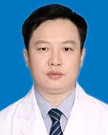

<!-- AUTO-GENERATED-BY: work/generate_obsidian_profiles.py -->

<!-- TEMPLATE: D:\workspace\信息收集整理\医生画像仓库\模板\医生画像模板.md -->

# 刘晓冰

## 基础信息

| 字段 | 内容 |
|---|---|
| 姓名 | 刘晓冰 |
| 医院 | 广东省人民医院 |
| 科室 | 心外科 |
| 职称/身份 | 主任医师 |
| 来源链接 | [官网原文](https://www.gdghospital.org.cn/Expertlistt/info_itemid_24374_subjectid_80.html) |
| 采集日期 | 2026-08-14 |

## 简介/擅长

各种复杂心脏畸形矫正、儿童及成人瓣膜病变的修复、大血管及冠脉血管畸形的矫治

## 论文与学术产出

- 2017年在国内首次发表冠状动脉异位起源于升主动脉并壁内走行畸形的外科矫治，救治了一批存在猝死风险的青中年，并积累国内最大宗病例；

## 可包装亮点

- 现任中华医学会胸心血管外科青委会全国委员，广东省医学会小儿外科分会心胸学组秘书。
- 2017年在国内首次发表冠状动脉异位起源于升主动脉并壁内走行畸形的外科矫治，救治了一批存在猝死风险的青中年，并积累国内最大宗病例；
- 现阶段利用大数据及人工智能进行先心病防诊治方案精准化研究；
- 依靠心研所前期两万例先心病的数据基础，构建先心病风险预测、精准诊疗和预后评估的模型，提升了先心病的总体治疗效果。

## 重点疾病/人群标签

- 慢性病：
- 肿瘤：
- 生殖疾病：胚胎、术后、康复、复杂
- 免疫/风湿：
- 术后恢复/康复：胚胎、术后、康复、复杂
- 疑难重症：胚胎、术后、康复、复杂

## 证据摘录

> 只摘录官网公开信息中的短句或关键字段，不复制大段原文。

- 官网身份字段：主任医师
- 官网简介/擅长：各种复杂心脏畸形矫正、儿童及成人瓣膜病变的修复、大血管及冠脉血管畸形的矫治
- 官网亮眼经历线索：现任中华医学会胸心血管外科青委会全国委员，广东省医学会小儿外科分会心胸学组秘书。 2017年在国内首次发表冠状动脉异位起源于升主动脉并壁内走行畸形的外科矫治，救治了一批存在猝死风险的青中年，并积累国内最大宗病例； 现阶段利用大数据及人工智能进行先心病防诊治方案精准化研究； 依靠心研所前期两万例先心病的数据基础，构建先心病风险预测、精准诊疗和预后评估的模型，提升了先心病的总体治疗效果。
- 来源链接：https://www.gdghospital.org.cn/Expertlistt/info_itemid_24374_subjectid_80.html

## BD 画像摘要

刘晓冰医生可作为生殖疾病、术后恢复/康复、疑难重症方向的基础画像候选。后续 BD 使用应继续以官网来源和人工复核为准，不添加疗效承诺或无来源包装。

## 合规边界

- 仅使用医院官网、官方公众号、官方小程序等公开渠道。
- 不采集私人电话、私人微信、家庭住址、患者隐私或非公开排班信息。
- 不写“保证治愈”“疗效第一”“包治疑难杂症”等无法由官网证明的表述。
