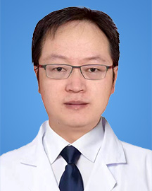

<!-- AUTO-GENERATED-BY: work/generate_obsidian_profiles.py -->

<!-- TEMPLATE: D:\workspace\信息收集整理\医生画像仓库\模板\医生画像模板.md -->

# 刘涛

## 基础信息

| 字段 | 内容 |
|---|---|
| 姓名 | 刘涛 |
| 医院 | 广东省人民医院 |
| 科室 | 鼻科 |
| 职称/身份 | 副主任医师 |
| 来源链接 | [官网原文](https://www.gdghospital.org.cn/Expertlistt/info_itemid_41733_subjectid_110.html) |
| 采集日期 | 2026-08-14 |

## 简介/擅长

鼻科相关疾病的鼻内镜微创手术治疗，如：内窥镜鼻窦外科（鼻中隔偏曲、慢性鼻窦炎伴鼻息肉以及鼻腔鼻窦良恶性肿瘤等）、鼻眼相关外科（慢性泪囊炎、外伤性视神经损伤等）、鼻颅底外科（脑脊液鼻漏、脑膜脑膨出等）、鼻-咽外科（腺样体肥大、鼻咽纤维血管瘤、鼻咽癌等）以及鼻背畸形等鼻整形外科

## 教育与进修经历

- 医学博士（博士后），耳鼻咽喉头颈外科副主任医师（主任医师资格），硕士研究生导师，广东省医学杰青人才，国家自然科学基金评审专家。

## 科研项目与成果

- 医学博士（博士后），耳鼻咽喉头颈外科副主任医师（主任医师资格），硕士研究生导师，广东省医学杰青人才，国家自然科学基金评审专家。
- 主持国家及省厅级科研课题10余项，发表国内外论文数十篇，获得国家发明专利数项。

## 论文与学术产出

- 主持国家及省厅级科研课题10余项，发表国内外论文数十篇，获得国家发明专利数项。

## 可包装亮点

- 医学博士（博士后），耳鼻咽喉头颈外科副主任医师（主任医师资格），硕士研究生导师，广东省医学杰青人才，国家自然科学基金评审专家。
- 广东省医师协会耳鼻咽喉科医师分会鼻科专业组副组长，广东省医学会耳鼻咽喉学分会青年委员会委员、咽喉学组成员及基础研究学组成员，中国抗癌协会康复会学术指导委员会委员。
- 主持国家及省厅级科研课题10余项，发表国内外论文数十篇，获得国家发明专利数项。

## 重点疾病/人群标签

- 慢性病：
- 肿瘤：
- 生殖疾病：
- 免疫/风湿：
- 术后恢复/康复：
- 疑难重症：

## 证据摘录

> 只摘录官网公开信息中的短句或关键字段，不复制大段原文。

- 官网身份字段：副主任医师
- 官网简介/擅长：鼻科相关疾病的鼻内镜微创手术治疗，如：内窥镜鼻窦外科（鼻中隔偏曲、慢性鼻窦炎伴鼻息肉以及鼻腔鼻窦良恶性肿瘤等）、鼻眼相关外科（慢性泪囊炎、外伤性视神经损伤等）、鼻颅底外科（脑脊液鼻漏、脑膜脑膨出等）、鼻-咽外科（腺样体肥大、鼻咽纤维血管瘤、鼻咽癌等）以及鼻背畸形等鼻整形外科
- 官网亮眼经历线索：医学博士（博士后），耳鼻咽喉头颈外科副主任医师（主任医师资格），硕士研究生导师，广东省医学杰青人才，国家自然科学基金评审专家。 广东省医师协会耳鼻咽喉科医师分会鼻科专业组副组长，广东省医学会耳鼻咽喉学分会青年委员会委员、咽喉学组成员及基础研究学组成员，中国抗癌协会康复会学术指导委员会委员。 主持国家及省厅级科研课题10余项，发表国内外论文数十篇，获得国家发明专利数项。
- 异常提示：同名待甄别
- 来源链接：https://www.gdghospital.org.cn/Expertlistt/info_itemid_41733_subjectid_110.html

## BD 画像摘要

刘涛医生可作为广东省人民医院鼻科的基础医生资料入库。当前重点方向以总底表标签为准，官网未展示的信息保持空白。

## 合规边界

- 仅使用医院官网、官方公众号、官方小程序等公开渠道。
- 不采集私人电话、私人微信、家庭住址、患者隐私或非公开排班信息。
- 不写“保证治愈”“疗效第一”“包治疑难杂症”等无法由官网证明的表述。
