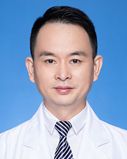

<!-- AUTO-GENERATED-BY: work/generate_obsidian_profiles.py -->

<!-- TEMPLATE: D:\workspace\信息收集整理\医生画像仓库\模板\医生画像模板.md -->

# 刘涛

## 基础信息

| 字段 | 内容 |
|---|---|
| 姓名 | 刘涛 |
| 医院 | 广东省人民医院 |
| 科室 | 皮肤性病科 |
| 职称/身份 | 副主任医师 |
| 来源链接 | [官网原文](https://www.gdghospital.org.cn/Expertlistt/info_itemid_23911_subjectid_22.html) |
| 采集日期 | 2026-08-14 |

## 简介/擅长

于采用国内外最新研究成果诊治各类常见皮肤病与性病，过敏性疾病如荨麻疹，小儿皮肤病，免疫性皮肤病，痤疮等，结合现代激光和医学美容技术治疗各类色素性皮肤病如黄褐斑及皮肤年轻化等治疗，皮肤屏障修复等

## 教育与进修经历

- 博士在读，毕业于中山大学皮肤病与性病学专业；

## 科研项目与成果

- 在国内外核心期刊发表论文多篇，主持省科研课题2项，参与多项；
- 主要从事于色素性疾病及过敏性疾病的临床研究，擅长于采用国内外最新研究成果诊治各类常见皮肤病与性病，过敏性疾病如荨麻疹，小儿皮肤病，免疫性皮肤病，痤疮等，结合现代激光和医学美容技术治疗各类色素性皮肤病如黄褐斑及皮肤年轻化等治疗，皮肤屏障修复等。

## 论文与学术产出

- 在国内外核心期刊发表论文多篇，主持省科研课题2项，参与多项；

## 可包装亮点

- 在国内外核心期刊发表论文多篇，主持省科研课题2项，参与多项；
- 广东省医师协会皮肤科分会过敏与变态反应学组 委员 广东省整形美容协会皮肤分会 青年委员；

## 重点疾病/人群标签

- 慢性病：
- 肿瘤：
- 生殖疾病：
- 免疫/风湿：
- 术后恢复/康复：
- 疑难重症：

## 证据摘录

> 只摘录官网公开信息中的短句或关键字段，不复制大段原文。

- 官网身份字段：副主任医师
- 官网简介/擅长：于采用国内外最新研究成果诊治各类常见皮肤病与性病，过敏性疾病如荨麻疹，小儿皮肤病，免疫性皮肤病，痤疮等，结合现代激光和医学美容技术治疗各类色素性皮肤病如黄褐斑及皮肤年轻化等治疗，皮肤屏障修复等
- 官网亮眼经历线索：在国内外核心期刊发表论文多篇，主持省科研课题2项，参与多项； 广东省医师协会皮肤科分会过敏与变态反应学组 委员 广东省整形美容协会皮肤分会 青年委员；
- 异常提示：同名待甄别
- 来源链接：https://www.gdghospital.org.cn/Expertlistt/info_itemid_23911_subjectid_22.html

## BD 画像摘要

刘涛医生可作为广东省人民医院皮肤性病科的基础医生资料入库。当前重点方向以总底表标签为准，官网未展示的信息保持空白。

## 合规边界

- 仅使用医院官网、官方公众号、官方小程序等公开渠道。
- 不采集私人电话、私人微信、家庭住址、患者隐私或非公开排班信息。
- 不写“保证治愈”“疗效第一”“包治疑难杂症”等无法由官网证明的表述。
