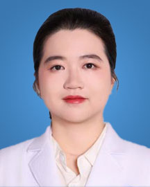

<!-- AUTO-GENERATED-BY: work/generate_obsidian_profiles.py -->

<!-- TEMPLATE: D:\workspace\信息收集整理\医生画像仓库\模板\医生画像模板.md -->

# 单惠庄

## 基础信息

| 字段 | 内容 |
|---|---|
| 姓名 | 单惠庄 |
| 医院 | 广东省人民医院 |
| 科室 | 检验科 |
| 职称/身份 | 主管技师 |
| 来源链接 | [官网原文](https://www.gdghospital.org.cn/Expertlistt/info_itemid_32981_subjectid_60.html) |
| 采集日期 | 2026-08-14 |

## 简介/擅长

## 教育与进修经历

- 检验科流式细胞组的科教组长，医学博士，广东省医疗行业协会委员，2021年博士毕业于上海交通大学医学院基础医学（病理学与病理生理学系）专业后来我院工作。

## 科研项目与成果

- 主持承担课题4项，包括国家自然科学基金青年项目1项、广东省基础与应用基础研究项目2项、广东省人民医院国家自然科学基金培育项目1项。

## 论文与学术产出

- 以第一作者/共同第一作者/通讯作者在Signal transduction and targeted therapy, Nature communications, Cell Death Disease，Cancer Cell International 等期刊发表SCI论文8篇，累计影响因子达80分。

## 可包装亮点

- 检验科流式细胞组的科教组长，医学博士，广东省医疗行业协会委员，2021年博士毕业于上海交通大学医学院基础医学（病理学与病理生理学系）专业后来我院工作。
- 主持承担课题4项，包括国家自然科学基金青年项目1项、广东省基础与应用基础研究项目2项、广东省人民医院国家自然科学基金培育项目1项。
- 以第一作者/共同第一作者/通讯作者在Signal transduction and targeted therapy, Nature communications, Cell Death Disease，Cancer Cell International 等期刊发表SCI论文8篇，累计影响因子达80分。

## 重点疾病/人群标签

- 慢性病：
- 肿瘤：
- 生殖疾病：
- 免疫/风湿：
- 术后恢复/康复：
- 疑难重症：

## 证据摘录

> 只摘录官网公开信息中的短句或关键字段，不复制大段原文。

- 官网身份字段：主管技师
- 官网亮眼经历线索：检验科流式细胞组的科教组长，医学博士，广东省医疗行业协会委员，2021年博士毕业于上海交通大学医学院基础医学（病理学与病理生理学系）专业后来我院工作。 主持承担课题4项，包括国家自然科学基金青年项目1项、广东省基础与应用基础研究项目2项、广东省人民医院国家自然科学基金培育项目1项。 以第一作者/共同第一作者/通讯作者在Signal transduction and targeted therapy, Nature communicat…
- 异常提示：职称/身份需人工复核
- 来源链接：https://www.gdghospital.org.cn/Expertlistt/info_itemid_32981_subjectid_60.html

## BD 画像摘要

单惠庄医生可作为广东省人民医院检验科的基础医生资料入库。当前重点方向以总底表标签为准，官网未展示的信息保持空白。

## 合规边界

- 仅使用医院官网、官方公众号、官方小程序等公开渠道。
- 不采集私人电话、私人微信、家庭住址、患者隐私或非公开排班信息。
- 不写“保证治愈”“疗效第一”“包治疑难杂症”等无法由官网证明的表述。
