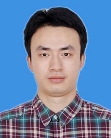

<!-- AUTO-GENERATED-BY: work/generate_obsidian_profiles.py -->

<!-- TEMPLATE: D:\workspace\信息收集整理\医生画像仓库\模板\医生画像模板.md -->

# 卢昕

## 基础信息

| 字段 | 内容 |
|---|---|
| 姓名 | 卢昕 |
| 医院 | 广东省人民医院 |
| 科室 | 肝胆外科 |
| 职称/身份 | 主治医师 |
| 来源链接 | [官网原文](https://www.gdghospital.org.cn/Expertlistt/info_itemid_32773_subjectid_105.html) |
| 采集日期 | 2026-08-14 |

## 简介/擅长

擅长肝胆胰脾恶性肿瘤肿瘤、肝囊肿、肝海绵状血管瘤、胆囊结石、胆囊炎、肝胆管结石等疾病的诊断与治疗，尤其擅长肝胆胰疾病的微创治疗 简介 医学博士，毕业于南方医科大学临床医学八年制（本硕博连读）

## 教育与进修经历

- 专长 擅长肝胆胰脾恶性肿瘤肿瘤、肝囊肿、肝海绵状血管瘤、胆囊结石、胆囊炎、肝胆管结石等疾病的诊断与治疗，尤其擅长肝胆胰疾病的微创治疗 简介 医学博士，毕业于南方医科大学临床医学八年制（本硕博连读）。

## 论文与学术产出

- 以第一作者在INT J SURG、J SURG RES等国内外期刊发表论文多篇，总IF＞17.5。

## 可包装亮点

- 广东省组团式帮扶第二批队员，援助汕尾市陆河县期间获“陆河好医生”称号。
- 以第一作者在INT J SURG、J SURG RES等国内外期刊发表论文多篇，总IF＞17.5。
- 学术任职 广东省卫生信息网络协会肝胆胰外科数字医学应用分会常委 广东省中西医结合学会普通外科微创专业委员会委员 广东省肝脏病学会肝癌专业委员会青年委员 广东省肝脏病学会肝癌多学科协作诊疗专业委员会委员 广东省医疗行业协会门静脉高压管理分会委员 广州市医师协会肝胆胰外科医师分会委员

## 重点疾病/人群标签

- 慢性病：
- 肿瘤：肿瘤、瘤、肝癌、多学科
- 生殖疾病：
- 免疫/风湿：
- 术后恢复/康复：
- 疑难重症：肿瘤、瘤、肝癌、多学科

## 证据摘录

> 只摘录官网公开信息中的短句或关键字段，不复制大段原文。

- 官网身份字段：主治医师
- 官网简介/擅长：擅长肝胆胰脾恶性肿瘤肿瘤、肝囊肿、肝海绵状血管瘤、胆囊结石、胆囊炎、肝胆管结石等疾病的诊断与治疗，尤其擅长肝胆胰疾病的微创治疗 简介 医学博士，毕业于南方医科大学临床医学八年制（本硕博连读）
- 官网亮眼经历线索：广东省组团式帮扶第二批队员，援助汕尾市陆河县期间获“陆河好医生”称号。 以第一作者在INT J SURG、J SURG RES等国内外期刊发表论文多篇，总IF＞17.5。 学术任职 广东省卫生信息网络协会肝胆胰外科数字医学应用分会常委 广东省中西医结合学会普通外科微创专业委员会委员 广东省肝脏病学会肝癌专业委员会青年委员 广东省肝脏病学会肝癌多学科协作诊疗专业委员会委员 广东省医疗行业协会门静脉高压管理分会委员 广州市医师协会肝胆胰外…
- 来源链接：https://www.gdghospital.org.cn/Expertlistt/info_itemid_32773_subjectid_105.html

## BD 画像摘要

卢昕医生可作为肿瘤、疑难重症方向的基础画像候选。后续 BD 使用应继续以官网来源和人工复核为准，不添加疗效承诺或无来源包装。

## 合规边界

- 仅使用医院官网、官方公众号、官方小程序等公开渠道。
- 不采集私人电话、私人微信、家庭住址、患者隐私或非公开排班信息。
- 不写“保证治愈”“疗效第一”“包治疑难杂症”等无法由官网证明的表述。
