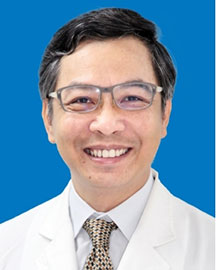

<!-- AUTO-GENERATED-BY: work/generate_obsidian_profiles.py -->

<!-- TEMPLATE: D:\workspace\信息收集整理\医生画像仓库\模板\医生画像模板.md -->

# 卢聪

## 基础信息

| 字段 | 内容 |
|---|---|
| 姓名 | 卢聪 |
| 医院 | 广东省人民医院 |
| 科室 | 心外科 |
| 职称/身份 | 主任医师 |
| 来源链接 | [官网原文](https://www.gdghospital.org.cn/Expertlistt/info_itemid_24336_subjectid_80.html) |
| 采集日期 | 2026-08-14 |

## 简介/擅长

心脏瓣膜、心律失常、先天性心脏病等外科手术治疗

## 科研项目与成果

- 曾主持《同种异体主动脉瓣移植实验及临床研究》以及参与《同种异体原位心脏移植的临床研究》、《左心辅助循环实验和临床研究》等大型省和国家级科研工作。
- 2006年主持省科委自然科学基金资助课题《调节性T细胞诱导心脏移植动物系统耐受的实验研究》等科研工作。

## 论文与学术产出

- 撰写20多篇文章在国家级杂志发表。

## 可包装亮点

- 医学博士 硕士生导师 心脏瓣膜专业学科带头人。
- 任中华医学会广东分会心胸外科委员，任中国医师协会瓣膜疾病外科副主任委员。
- 撰写20多篇文章在国家级杂志发表。

## 重点疾病/人群标签

- 慢性病：
- 肿瘤：
- 生殖疾病：
- 免疫/风湿：
- 术后恢复/康复：
- 疑难重症：

## 证据摘录

> 只摘录官网公开信息中的短句或关键字段，不复制大段原文。

- 官网身份字段：主任医师
- 官网简介/擅长：心脏瓣膜、心律失常、先天性心脏病等外科手术治疗
- 官网亮眼经历线索：医学博士 硕士生导师 心脏瓣膜专业学科带头人。 任中华医学会广东分会心胸外科委员，任中国医师协会瓣膜疾病外科副主任委员。 撰写20多篇文章在国家级杂志发表。
- 来源链接：https://www.gdghospital.org.cn/Expertlistt/info_itemid_24336_subjectid_80.html

## BD 画像摘要

卢聪医生可作为广东省人民医院心外科的基础医生资料入库。当前重点方向以总底表标签为准，官网未展示的信息保持空白。

## 合规边界

- 仅使用医院官网、官方公众号、官方小程序等公开渠道。
- 不采集私人电话、私人微信、家庭住址、患者隐私或非公开排班信息。
- 不写“保证治愈”“疗效第一”“包治疑难杂症”等无法由官网证明的表述。
