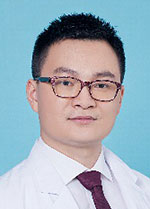

<!-- AUTO-GENERATED-BY: work/generate_obsidian_profiles.py -->

<!-- TEMPLATE: D:\workspace\信息收集整理\医生画像仓库\模板\医生画像模板.md -->

# 吕泽坚

## 基础信息

| 字段 | 内容 |
|---|---|
| 姓名 | 吕泽坚 |
| 医院 | 广东省人民医院 |
| 科室 | 胃肠外科 |
| 职称/身份 | 副主任医师 |
| 来源链接 | [官网原文](https://www.gdghospital.org.cn/Expertlistt/info_itemid_24158_subjectid_104.html) |
| 采集日期 | 2026-08-14 |

## 简介/擅长

结直肠肿瘤的微创治疗和综合治疗，以及加速康复外科（ERAS）理念在胃肠外科的应用

## 科研项目与成果

- 专业学术领域成就 ： 主持省级课题两项，在《Annals of Surgical Oncology》、《Surgery》、《中华胃肠外科杂志》、《中华外科杂志》、《中国实用外科杂志》等中外核心期刊发表专业学术论文20余篇，参编《腹腔镜胃肠手术笔记》、《胃肠外科加速康复实战笔记》。

## 论文与学术产出

- 专业学术领域成就 ： 主持省级课题两项，在《Annals of Surgical Oncology》、《Surgery》、《中华胃肠外科杂志》、《中华外科杂志》、《中国实用外科杂志》等中外核心期刊发表专业学术论文20余篇，参编《腹腔镜胃肠手术笔记》、《胃肠外科加速康复实战笔记》。

## 可包装亮点

- 中共党员 主要社会兼职 ： 广东省药学会医药创新与转化专家委员会委员兼秘书 广州抗癌协会消化道肿瘤青年委员会常务委员兼秘书 广东省医学教育协会普通外科专业委员会委员 广东省精准医学应用学会胃肠肿瘤分会委员 广州抗癌协会肿瘤生物治疗专业委员会委员 广州市医学会胃肠外科学分会委员 专业特长 ： 擅长结直肠肿瘤的微创治疗和综合治疗，以及加速康复外科（ERAS）理…
- 专业学术领域成就 ： 主持省级课题两项，在《Annals of Surgical Oncology》、《Surgery》、《中华胃肠外科杂志》、《中华外科杂志》、《中国实用外科杂志》等中外核心期刊发表专业学术论文20余篇，参编《腹腔镜胃肠手术笔记》、《胃肠外科加速康复实战笔记》。

## 重点疾病/人群标签

- 慢性病：
- 肿瘤：肿瘤、癌、康复
- 生殖疾病：
- 免疫/风湿：
- 术后恢复/康复：肿瘤、癌、康复
- 疑难重症：

## 证据摘录

> 只摘录官网公开信息中的短句或关键字段，不复制大段原文。

- 官网身份字段：副主任医师
- 官网简介/擅长：结直肠肿瘤的微创治疗和综合治疗，以及加速康复外科（ERAS）理念在胃肠外科的应用
- 官网亮眼经历线索：中共党员 主要社会兼职 ： 广东省药学会医药创新与转化专家委员会委员兼秘书 广州抗癌协会消化道肿瘤青年委员会常务委员兼秘书 广东省医学教育协会普通外科专业委员会委员 广东省精准医学应用学会胃肠肿瘤分会委员 广州抗癌协会肿瘤生物治疗专业委员会委员 广州市医学会胃肠外科学分会委员 专业特长 ： 擅长结直肠肿瘤的微创治疗和综合治疗，以及加速康复外科（ERAS）理念在胃肠外科的应用。 专业学术领域成就 ： 主持省级课题两项，在《Annals…
- 来源链接：https://www.gdghospital.org.cn/Expertlistt/info_itemid_24158_subjectid_104.html

## BD 画像摘要

吕泽坚医生可作为肿瘤、术后恢复/康复方向的基础画像候选。后续 BD 使用应继续以官网来源和人工复核为准，不添加疗效承诺或无来源包装。

## 合规边界

- 仅使用医院官网、官方公众号、官方小程序等公开渠道。
- 不采集私人电话、私人微信、家庭住址、患者隐私或非公开排班信息。
- 不写“保证治愈”“疗效第一”“包治疑难杂症”等无法由官网证明的表述。
