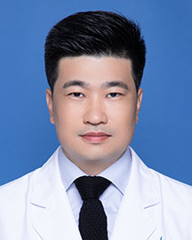

<!-- AUTO-GENERATED-BY: work/generate_obsidian_profiles.py -->

<!-- TEMPLATE: D:\workspace\信息收集整理\医生画像仓库\模板\医生画像模板.md -->

# 吴德庆

## 基础信息

| 字段 | 内容 |
|---|---|
| 姓名 | 吴德庆 |
| 医院 | 广东省人民医院 |
| 科室 | 协和高级医疗中心（全科医学科） |
| 职称/身份 | 副主任医师 行政副主任 |
| 来源链接 | [官网原文](https://www.gdghospital.org.cn/Expertlistt/info_itemid_62954_subjectid_75.html) |
| 采集日期 | 2026-08-14 |

## 简介/擅长

结直肠外科疾病诊治，擅长腹腔镜结直肠肿瘤根治手术、加速康复外科和大肠癌遗传咨询

## 科研项目与成果

- 医学研究 ：主持省级课题2项，市厅级课题1项，参与多个国际多中心临床试验。

## 论文与学术产出

- 发表10余篇研究文章，其中10篇（第一作者或通讯作者）被SCI收录，总IF超过20分。
- 副主编《胃肠外科加速康复实战笔记》、参编多本中英文著作:《腹腔镜胃肠外科手术笔记》和《NOTES ON LAPAROSCOPIC GASTROINTESTINAL SURGERY》。

## 可包装亮点

- 临床医学博士， 协和高级医疗中心行政副主任（主持工作） 胃肠外科行政副主任 学习经历 ：曾在新西兰、韩国、以色列、英国和日本医院学习，拥有国家遗传咨询资格和英国朴茨茅斯大学家庭医生资格 专业特长：熟悉结直肠外科疾病诊治，擅长腹腔镜结直肠肿瘤根治手术、加速康复外科和大肠癌遗传咨询。
- 协会任职 ：中国临床肿瘤协会青委会常务委员、广州抗癌协会大肠癌委员会常务委员兼秘书、广东省抗癌协会大肠癌委员会青委会副主任委员、广州抗癌协会消化道肿瘤青年委员会副主任委员等。
- 发表10余篇研究文章，其中10篇（第一作者或通讯作者）被SCI收录，总IF超过20分。
- 外科荣誉 ：曾获 “博彩众肠腔镜结直肠手术视频比赛全国十强（2015）”、“镜技影院广东省腹腔镜手微创手术视频大赛最佳手术奖（2016）”等荣誉，腹腔镜手术录像多次在世界胃癌大会和亚洲腔镜内镜大会展播。

## 重点疾病/人群标签

- 慢性病：
- 肿瘤：
- 生殖疾病：
- 免疫/风湿：
- 术后恢复/康复：
- 疑难重症：

## 证据摘录

> 只摘录官网公开信息中的短句或关键字段，不复制大段原文。

- 官网身份字段：副主任医师 行政副主任
- 官网简介/擅长：结直肠外科疾病诊治，擅长腹腔镜结直肠肿瘤根治手术、加速康复外科和大肠癌遗传咨询
- 官网亮眼经历线索：临床医学博士， 协和高级医疗中心行政副主任（主持工作） 胃肠外科行政副主任 学习经历 ：曾在新西兰、韩国、以色列、英国和日本医院学习，拥有国家遗传咨询资格和英国朴茨茅斯大学家庭医生资格 专业特长：熟悉结直肠外科疾病诊治，擅长腹腔镜结直肠肿瘤根治手术、加速康复外科和大肠癌遗传咨询。 协会任职 ：中国临床肿瘤协会青委会常务委员、广州抗癌协会大肠癌委员会常务委员兼秘书、广东省抗癌协会大肠癌委员会青委会副主任委员、广州抗癌协会消化道肿瘤青年委…
- 异常提示：同名待甄别
- 来源链接：https://www.gdghospital.org.cn/Expertlistt/info_itemid_62954_subjectid_75.html

## BD 画像摘要

吴德庆医生可作为广东省人民医院协和高级医疗中心（全科医学科）的基础医生资料入库。当前重点方向以总底表标签为准，官网未展示的信息保持空白。

## 合规边界

- 仅使用医院官网、官方公众号、官方小程序等公开渠道。
- 不采集私人电话、私人微信、家庭住址、患者隐私或非公开排班信息。
- 不写“保证治愈”“疗效第一”“包治疑难杂症”等无法由官网证明的表述。
