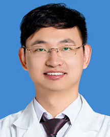

<!-- AUTO-GENERATED-BY: work/generate_obsidian_profiles.py -->

<!-- TEMPLATE: D:\workspace\信息收集整理\医生画像仓库\模板\医生画像模板.md -->

# 吴晔

## 基础信息

| 字段 | 内容 |
|---|---|
| 姓名 | 吴晔 |
| 医院 | 广东省人民医院 |
| 科室 | 血管外科 |
| 职称/身份 | 副主任医师 |
| 来源链接 | [官网原文](https://www.gdghospital.org.cn/Expertlistt/info_itemid_49166_subjectid_9.html) |
| 采集日期 | 2026-08-14 |

## 简介/擅长

熟练掌握血管外科常见病，擅长：腹主动脉瘤，主动脉夹层，动脉硬化闭塞症，动脉栓塞，静脉曲张，主动脉弓动脉瘤，胸主动脉瘤，髂动脉瘤，肾动脉瘤，脾动脉瘤，肠系膜上动脉夹层，肠系膜上动脉瘤，颈动脉狭窄闭塞，锁骨下动脉病变，肾动脉狭窄，血栓闭塞性脉管炎，大动脉炎，下肢深静脉血栓形成，布加氏综合征，门脉高压症，血管瘤，血管畸形

## 科研项目与成果

- 简介 医学博士，中共党员，师从血管外科泰斗汪忠镐院士及北京301医院郭伟教授，长期从事血管外科临床及教学科研工作，连续8年多次参与完成国际会议疑难手术直播演示。
- 以第一作者身份发表国内外论著二十余篇，主持完成国家自然科学基金1项，军队课题2项，参与国家科技部重大项目，国自然及北自然等多项，参编著作2项，实用新型专利1项，国际脉管联盟中国区腹主动脉学组委员；

## 论文与学术产出

- 以第一作者身份发表国内外论著二十余篇，主持完成国家自然科学基金1项，军队课题2项，参与国家科技部重大项目，国自然及北自然等多项，参编著作2项，实用新型专利1项，国际脉管联盟中国区腹主动脉学组委员；

## 可包装亮点

- 简介 医学博士，中共党员，师从血管外科泰斗汪忠镐院士及北京301医院郭伟教授，长期从事血管外科临床及教学科研工作，连续8年多次参与完成国际会议疑难手术直播演示。
- 以第一作者身份发表国内外论著二十余篇，主持完成国家自然科学基金1项，军队课题2项，参与国家科技部重大项目，国自然及北自然等多项，参编著作2项，实用新型专利1项，国际脉管联盟中国区腹主动脉学组委员；
- 北京医学会介入医学分会复合手术学组委员；
- 中国微循环学会周围血管疾病专委中青年委员；

## 重点疾病/人群标签

- 慢性病：
- 肿瘤：瘤、疑难
- 生殖疾病：
- 免疫/风湿：
- 术后恢复/康复：
- 疑难重症：瘤、疑难

## 证据摘录

> 只摘录官网公开信息中的短句或关键字段，不复制大段原文。

- 官网身份字段：副主任医师
- 官网简介/擅长：熟练掌握血管外科常见病，擅长：腹主动脉瘤，主动脉夹层，动脉硬化闭塞症，动脉栓塞，静脉曲张，主动脉弓动脉瘤，胸主动脉瘤，髂动脉瘤，肾动脉瘤，脾动脉瘤，肠系膜上动脉夹层，肠系膜上动脉瘤，颈动脉狭窄闭塞，锁骨下动脉病变，肾动脉狭窄，血栓闭塞性脉管炎，大动脉炎，下肢深静脉血栓形成，布加氏综合征，门脉高压症，血管瘤，血管畸形
- 官网亮眼经历线索：简介 医学博士，中共党员，师从血管外科泰斗汪忠镐院士及北京301医院郭伟教授，长期从事血管外科临床及教学科研工作，连续8年多次参与完成国际会议疑难手术直播演示。 以第一作者身份发表国内外论著二十余篇，主持完成国家自然科学基金1项，军队课题2项，参与国家科技部重大项目，国自然及北自然等多项，参编著作2项，实用新型专利1项，国际脉管联盟中国区腹主动脉学组委员； 北京医学会介入医学分会复合手术学组委员； 中国微循环学会周围血管疾病专委中青年…
- 来源链接：https://www.gdghospital.org.cn/Expertlistt/info_itemid_49166_subjectid_9.html

## BD 画像摘要

吴晔医生可作为肿瘤、疑难重症方向的基础画像候选。后续 BD 使用应继续以官网来源和人工复核为准，不添加疗效承诺或无来源包装。

## 合规边界

- 仅使用医院官网、官方公众号、官方小程序等公开渠道。
- 不采集私人电话、私人微信、家庭住址、患者隐私或非公开排班信息。
- 不写“保证治愈”“疗效第一”“包治疑难杂症”等无法由官网证明的表述。
