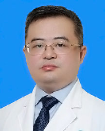

<!-- AUTO-GENERATED-BY: work/generate_obsidian_profiles.py -->

<!-- TEMPLATE: D:\workspace\信息收集整理\医生画像仓库\模板\医生画像模板.md -->

# 吴泽宇

## 基础信息

| 字段 | 内容 |
|---|---|
| 姓名 | 吴泽宇 |
| 医院 | 广东省人民医院 |
| 科室 | 甲状腺疝外科 |
| 职称/身份 | 主任医师 |
| 来源链接 | [官网原文](https://www.gdghospital.org.cn/Expertlistt/info_itemid_24138_subjectid_107.html) |
| 采集日期 | 2026-08-14 |

## 简介/擅长

在甲状腺癌规范化治疗和甲状旁腺疾病治疗领域具有深厚的理论基础和丰富的临床经验

## 教育与进修经历

- 中共党员，外科副主任，甲状腺疝外科行政主任，第三党支部书记，博士，博士生导师、博士后合作导师。
- 德国利帕医院公派访问学者。

## 论文与学术产出

- 在国内外核心刊物发表论文共80余篇，其中SCI论文20余篇。
- 主编主译专著3部，参编专著4部。

## 可包装亮点

- 中共党员，外科副主任，甲状腺疝外科行政主任，第三党支部书记，博士，博士生导师、博士后合作导师。
- 作为主要成员参与国内多部指南和专家共识的制定。
- 主要社会兼职 中国抗癌协会肿瘤微创治疗专业委员会甲状腺分会主任委员，国家卫生健康委介入医学专家委员会第一届副主任委员兼甲状腺学组组长，广东省医师协会甲状腺医师分会第三届主任委员，广东省医学会外科学分会甲状腺甲状旁腺学组组长、广东省药学会甲状腺专家委员会第二届荣誉主任委员，中华内分泌外科杂志第四届编委会委员等。
- 教育经历 美国德州大学西南医学中心访问教授、Faculty。

## 重点疾病/人群标签

- 慢性病：
- 肿瘤：肿瘤、癌
- 生殖疾病：
- 免疫/风湿：
- 术后恢复/康复：
- 疑难重症：

## 证据摘录

> 只摘录官网公开信息中的短句或关键字段，不复制大段原文。

- 官网身份字段：主任医师
- 官网简介/擅长：在甲状腺癌规范化治疗和甲状旁腺疾病治疗领域具有深厚的理论基础和丰富的临床经验
- 官网亮眼经历线索：中共党员，外科副主任，甲状腺疝外科行政主任，第三党支部书记，博士，博士生导师、博士后合作导师。 作为主要成员参与国内多部指南和专家共识的制定。 主要社会兼职 中国抗癌协会肿瘤微创治疗专业委员会甲状腺分会主任委员，国家卫生健康委介入医学专家委员会第一届副主任委员兼甲状腺学组组长，广东省医师协会甲状腺医师分会第三届主任委员，广东省医学会外科学分会甲状腺甲状旁腺学组组长、广东省药学会甲状腺专家委员会第二届荣誉主任委员，中华内分泌外科杂志第四…
- 来源链接：https://www.gdghospital.org.cn/Expertlistt/info_itemid_24138_subjectid_107.html

## BD 画像摘要

吴泽宇医生可作为肿瘤方向的基础画像候选。后续 BD 使用应继续以官网来源和人工复核为准，不添加疗效承诺或无来源包装。

## 合规边界

- 仅使用医院官网、官方公众号、官方小程序等公开渠道。
- 不采集私人电话、私人微信、家庭住址、患者隐私或非公开排班信息。
- 不写“保证治愈”“疗效第一”“包治疑难杂症”等无法由官网证明的表述。
