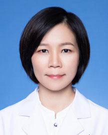

<!-- AUTO-GENERATED-BY: work/generate_obsidian_profiles.py -->

<!-- TEMPLATE: D:\workspace\信息收集整理\医生画像仓库\模板\医生画像模板.md -->

# 吴淑燕

## 基础信息

| 字段 | 内容 |
|---|---|
| 姓名 | 吴淑燕 |
| 医院 | 广东省人民医院 |
| 科室 | 产科 |
| 职称/身份 | 副主任医师 |
| 来源链接 | [官网原文](https://www.gdghospital.org.cn/Expertlistt/info_itemid_55026_subjectid_52.html) |
| 采集日期 | 2026-08-14 |

## 简介/擅长

熟悉产科常见病、多发病、产科合并症及并发症的诊疗，尤其对母胎心血管疾病诊治经验丰富

## 教育与进修经历

- 2007年华中科技大学同济医学院本科毕业，中山大学硕士毕业。
- 妇产科住院医师规范化培训的骨干师资和摸拟教学思维和方法导师。
- 社会任职 ： 广东省医师协会母胎医学医师分会第二届委员会季员 广东省临床医学学会临床规范化培训与管理专业委员会青年委员 广东省人民医院先心病产前产后一体化诊疗中心专家委员会委员

## 科研项目与成果

- 主持一项科研项目，发表学述论文近20篇。

## 论文与学术产出

- 主持一项科研项目，发表学述论文近20篇。

## 可包装亮点

- 主持一项科研项目，发表学述论文近20篇。
- 社会任职 ： 广东省医师协会母胎医学医师分会第二届委员会季员 广东省临床医学学会临床规范化培训与管理专业委员会青年委员 广东省人民医院先心病产前产后一体化诊疗中心专家委员会委员

## 重点疾病/人群标签

- 慢性病：
- 肿瘤：
- 生殖疾病：
- 免疫/风湿：
- 术后恢复/康复：
- 疑难重症：

## 证据摘录

> 只摘录官网公开信息中的短句或关键字段，不复制大段原文。

- 官网身份字段：副主任医师
- 官网简介/擅长：熟悉产科常见病、多发病、产科合并症及并发症的诊疗，尤其对母胎心血管疾病诊治经验丰富
- 官网亮眼经历线索：主持一项科研项目，发表学述论文近20篇。 社会任职 ： 广东省医师协会母胎医学医师分会第二届委员会季员 广东省临床医学学会临床规范化培训与管理专业委员会青年委员 广东省人民医院先心病产前产后一体化诊疗中心专家委员会委员
- 来源链接：https://www.gdghospital.org.cn/Expertlistt/info_itemid_55026_subjectid_52.html

## BD 画像摘要

吴淑燕医生可作为广东省人民医院产科的基础医生资料入库。当前重点方向以总底表标签为准，官网未展示的信息保持空白。

## 合规边界

- 仅使用医院官网、官方公众号、官方小程序等公开渠道。
- 不采集私人电话、私人微信、家庭住址、患者隐私或非公开排班信息。
- 不写“保证治愈”“疗效第一”“包治疑难杂症”等无法由官网证明的表述。
